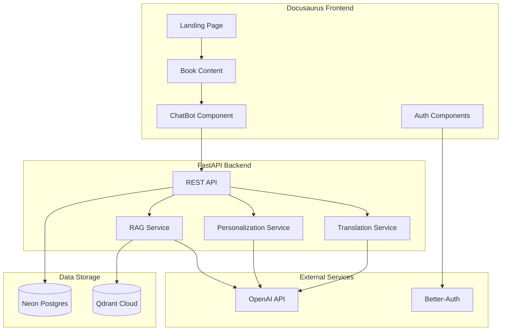

# Technical Implementation Plan

## Metadata
- **Feature ID:** 001-physical-ai-textbook
- **Created:** 2025-12-16
- **Status:** Draft

---

## 1. Architecture Overview



---

## 2. Technology Stack

### 2.1 Frontend
| Component | Technology | Version | Rationale |
|-----------|------------|---------|-----------|
| Framework | Docusaurus | 3.6.x | Industry-standard docs framework |
| UI Library | React | 18.x | Built into Docusaurus |
| Styling | CSS Modules | - | Clean, scoped styles |
| State | React Context | - | Simple, no extra deps |

### 2.2 Backend
| Component | Technology | Version | Rationale |
|-----------|------------|---------|-----------|
| Framework | FastAPI | 0.115.x | Fast, modern Python API |
| AI SDK | OpenAI Agents SDK | 0.5.x | Required by hackathon |
| ORM | SQLAlchemy | 2.0.x | Robust database access |
| Auth | better-auth | latest | Required by hackathon |

### 2.3 Storage
| Component | Technology | Rationale |
|-----------|------------|-----------|
| Relational DB | Neon Serverless Postgres | Required, serverless scaling |
| Vector DB | Qdrant Cloud Free Tier | Required, efficient vectors |

### 2.4 Deployment
| Component | Platform | Rationale |
|-----------|----------|-----------|
| Frontend | GitHub Pages | Free, simple deployment |
| Backend | Vercel/Railway | Serverless Python support |

---

## 3. Component Design

### 3.1 Docusaurus Book Structure

```
docs/
├── intro.md                    # Course overview
├── getting-started/
│   ├── what-is-physical-ai.md
│   └── hardware-requirements.md
├── module-1-ros2/
│   ├── index.md               # Module overview
│   ├── nodes-topics-services.md
│   ├── python-rclpy.md
│   └── urdf-humanoids.md
├── module-2-simulation/
│   ├── index.md
│   ├── gazebo-physics.md
│   ├── unity-rendering.md
│   └── sensor-simulation.md
├── module-3-isaac/
│   ├── index.md
│   ├── isaac-sim.md
│   ├── isaac-ros-vslam.md
│   └── nav2-planning.md
├── module-4-vla/
│   ├── index.md
│   ├── voice-to-action.md
│   ├── cognitive-planning.md
│   └── capstone-project.md
└── assessments/
    └── projects.md
```

### 3.2 Backend API Endpoints

| Method | Endpoint | Description |
|--------|----------|-------------|
| POST | `/api/chat` | RAG chatbot query |
| POST | `/api/chat/context` | Query with selected text context |
| POST | `/api/auth/signup` | User registration |
| POST | `/api/auth/signin` | User login |
| GET | `/api/auth/session` | Get current session |
| POST | `/api/personalize` | Personalize chapter content |
| POST | `/api/translate` | Translate to Urdu |
| GET | `/health` | Health check |

### 3.3 Database Schema

```sql
-- Users table
CREATE TABLE users (
    id UUID PRIMARY KEY DEFAULT gen_random_uuid(),
    email VARCHAR(255) UNIQUE NOT NULL,
    password_hash VARCHAR(255) NOT NULL,
    created_at TIMESTAMP DEFAULT NOW()
);

-- User profiles (background info)
CREATE TABLE user_profiles (
    id UUID PRIMARY KEY DEFAULT gen_random_uuid(),
    user_id UUID REFERENCES users(id),
    software_experience TEXT,
    hardware_experience TEXT,
    programming_languages TEXT[],
    robotics_background TEXT,
    created_at TIMESTAMP DEFAULT NOW()
);

-- Chat history
CREATE TABLE chat_messages (
    id UUID PRIMARY KEY DEFAULT gen_random_uuid(),
    user_id UUID REFERENCES users(id),
    message TEXT NOT NULL,
    response TEXT NOT NULL,
    created_at TIMESTAMP DEFAULT NOW()
);

-- Translation cache
CREATE TABLE translation_cache (
    id UUID PRIMARY KEY DEFAULT gen_random_uuid(),
    content_hash VARCHAR(64) UNIQUE NOT NULL,
    original_content TEXT NOT NULL,
    translated_content TEXT NOT NULL,
    created_at TIMESTAMP DEFAULT NOW()
);

-- Personalization cache
CREATE TABLE personalization_cache (
    id UUID PRIMARY KEY DEFAULT gen_random_uuid(),
    user_id UUID REFERENCES users(id),
    content_hash VARCHAR(64) NOT NULL,
    personalized_content TEXT NOT NULL,
    created_at TIMESTAMP DEFAULT NOW(),
    UNIQUE(user_id, content_hash)
);
```

---

## 4. RAG Implementation

### 4.1 Ingestion Pipeline

```python
# Pseudocode for content ingestion
1. Read all .md files from docs/ directory
2. Split into chunks (max 800 tokens, overlap 100)
3. Generate embeddings using OpenAI text-embedding-3-small
4. Store in Qdrant with metadata (file_path, chunk_index)
5. Store document metadata in Postgres
```

### 4.2 Query Pipeline

```python
# Pseudocode for RAG query
1. Receive user question
2. (Optional) Include selected text as additional context
3. Generate question embedding
4. Search Qdrant for top 5 similar chunks
5. Build prompt with retrieved context
6. Call OpenAI GPT-4o-mini with system prompt + context + question
7. Return response with source citations
```

---

## 5. Security Considerations

- Environment variables for all secrets
- CORS restricted to frontend domain
- Rate limiting on API endpoints
- Password hashing with bcrypt
- SQL injection prevention via ORM
- XSS prevention via React

---

## 6. Implementation Order

Based on dependencies:

1. **Docusaurus Setup** (no dependencies)
2. **Book Content** (depends on 1)
3. **FastAPI Backend** (no dependencies)
4. **Neon + Qdrant Setup** (no dependencies)
5. **RAG Ingestion** (depends on 2, 4)
6. **RAG Query API** (depends on 3, 5)
7. **ChatBot Component** (depends on 1, 6)
8. **Auth (better-auth)** (depends on 3, 4)
9. **Personalization** (depends on 8)
10. **Translation** (depends on 3)
11. **Deployment** (depends on all above)

---

*Plan created following Spec-Kit Plus methodology*
