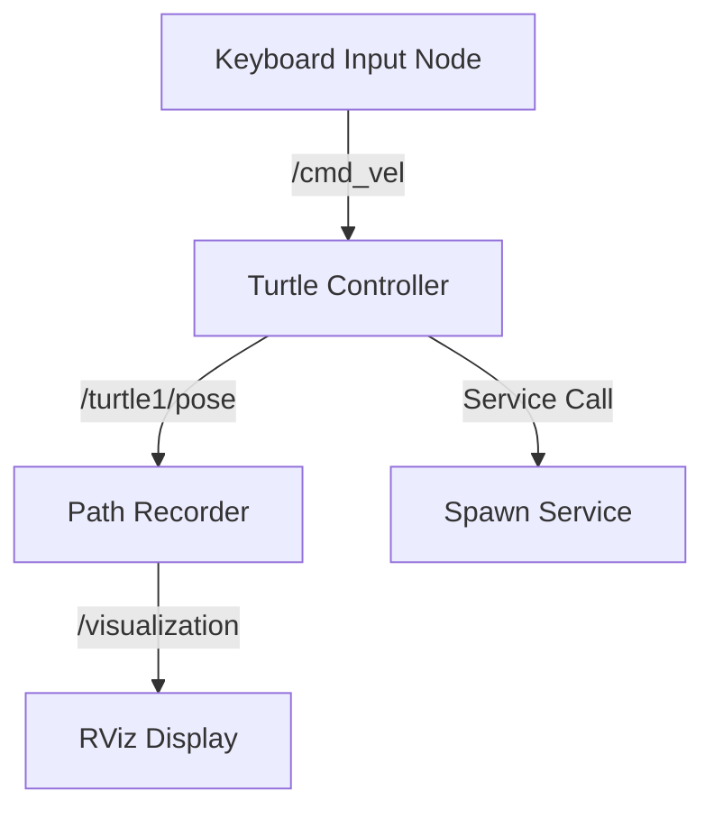

# Module 1: ROS 2 Foundations

Welcome to the first module of the Physical AI curriculum. In this module, we will establish the fundamental skills required to build modular, scalable robot software using the **Robot Operating System 2 (ROS 2)**.

## Why ROS 2?

ROS 2 is the de facto standard middleware for robotics development worldwide. Unlike its predecessor ROS 1, ROS 2 is designed from the ground up for:

- **Real-time systems:** Deterministic execution for safety-critical applications
- **Multi-robot coordination:** Built-in support for distributed systems
- **Security:** Encrypted communications and access control
- **Cross-platform:** Native support for Linux, Windows, and macOS

### Industry Adoption

Major companies and research institutions using ROS 2 include:

| Organization | Application |
|--------------|-------------|
| **Boston Dynamics** | Spot & Atlas control systems |
| **NASA** | Mars rover development |
| **Toyota Research** | Autonomous driving research |
| **Amazon Robotics** | Warehouse automation |
| **Open Robotics** | Core development & maintenance |

## Learning Objectives

By the end of this module, you will be able to:

1. **Understand the ROS 2 Architecture**
   - Master the computation graph concept (Nodes, Topics, Services, Actions)
   - Navigate the ROS 2 workspace structure
   - Use essential CLI tools (`ros2 node`, `ros2 topic`, `ros2 service`)

2. **Write Python ROS 2 Applications**
   - Create custom nodes using `rclpy`
   - Implement publishers and subscribers
   - Build service servers and clients
   - Handle parameters and launch files

3. **Model Robots with URDF**
   - Define robot geometry and kinematics
   - Add visual meshes and collision geometry
   - Integrate sensors (cameras, LiDAR, IMU)
   - Use TF2 for coordinate frame management

4. **Launch Complex Systems**
   - Write Python launch files
   - Configure node parameters
   - Manage multi-node deployments

## Prerequisites

Before starting this module, ensure you have:

### Technical Skills
- **Python Programming:** Comfortable with classes, functions, and decorators
- **Linux Basics:** Terminal navigation, file permissions, package management
- **Object-Oriented Programming:** Inheritance, interfaces, design patterns

### Environment Setup
- **Ubuntu 22.04 LTS** (recommended) or Windows 11 with WSL2
- **ROS 2 Humble Hawksbill** (LTS release, support until 2027)
- **Python 3.10+** with pip package manager

### Installation Quick Start

```bash
# Add ROS 2 repository
sudo apt update && sudo apt install -y software-properties-common
sudo add-apt-repository universe
sudo curl -sSL https://raw.githubusercontent.com/ros/rosdistro/master/ros.key -o /usr/share/keyrings/ros-archive-keyring.gpg

# Install ROS 2 Humble
sudo apt update
sudo apt install ros-humble-desktop

# Source ROS 2 environment
echo "source /opt/ros/humble/setup.bash" >> ~/.bashrc
source ~/.bashrc

# Verify installation
ros2 --version
```

## Module Structure

This module is organized into progressive chapters:

### Chapter 1: Nodes, Topics, & Services
The building blocks of every ROS 2 system. Learn how processes communicate through message passing.

**Key Concepts:**
- The ROS 2 computation graph
- Publisher-Subscriber pattern
- Request-Response services
- Quality of Service (QoS) profiles

### Chapter 2: Python Client Library (rclpy)
Hands-on programming with ROS 2's official Python API.

**Key Concepts:**
- Node lifecycle management
- Callbacks and executors
- Custom message types
- Error handling and logging

### Chapter 3: URDF & TF2
Describe your robot's physical structure and manage coordinate transformations.

**Key Concepts:**
- XML robot description format
- Joint types (revolute, prismatic, fixed)
- Visual vs. collision geometry
- Transform trees and lookups

## Hands-On Project: Turtlesim Explorer

Throughout this module, you'll build a complete ROS 2 application that:

1. Spawns multiple turtles in the Turtlesim simulator
2. Implements keyboard teleoperation
3. Records and playback turtle trajectories
4. Visualizes paths using custom markers



## Assessment Criteria

Your understanding will be evaluated through:

- **Quizzes:** Multiple choice on core concepts
- **Coding Exercises:** Implement specified node behaviors
- **Capstone Project:** Build a multi-node robot controller

## Additional Resources

- 📖 [ROS 2 Official Documentation](https://docs.ros.org/en/humble/)
- 🎥 [ROS 2 Video Tutorials](https://www.theconstructsim.com/)
- 💬 [ROS Discourse Community](https://discourse.ros.org/)
- 📚 [Programming Robots with ROS 2](https://www.oreilly.com/)

---

**Ready to begin?** Continue to [Chapter 1: Nodes, Topics, & Services](./nodes-topics-services) →
