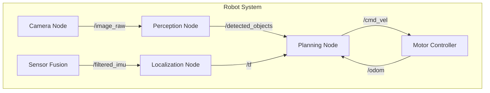

# Chapter 1: Nodes, Topics, & Services

The foundation of every ROS 2 system is the **computation graph** - a network of processes that communicate through well-defined interfaces. Understanding this architecture is essential for building scalable robot software.

## The ROS 2 Computation Graph

Think of the computation graph as a city's infrastructure:
- **Nodes** are the buildings (individual programs)
- **Topics** are the roads (data highways)
- **Services** are the post offices (request-response centers)
- **Actions** are the delivery services (long-running tasks with feedback)



## Nodes: The Building Blocks

A **Node** is a single, modular process that performs a specific task. Well-designed nodes follow the Unix philosophy: "Do one thing and do it well."

### Node Characteristics

| Property | Description |
|----------|-------------|
| **Name** | Unique identifier in the graph (e.g., `/camera_driver`) |
| **Namespace** | Logical grouping (e.g., `/robot1/camera_driver`) |
| **Lifecycle** | States: Unconfigured → Inactive → Active → Finalized |
| **Parameters** | Runtime configuration (e.g., frame rate, resolution) |

### Creating Your First Node

```python
#!/usr/bin/env python3
import rclpy
from rclpy.node import Node

class MinimalNode(Node):
    def __init__(self):
        super().__init__('minimal_node')
        self.get_logger().info('Hello from ROS 2!')
        
        # Create a timer that fires every second
        self.timer = self.create_timer(1.0, self.timer_callback)
        self.counter = 0
    
    def timer_callback(self):
        self.counter += 1
        self.get_logger().info(f'Timer fired {self.counter} times')

def main(args=None):
    rclpy.init(args=args)
    node = MinimalNode()
    
    try:
        rclpy.spin(node)  # Keep the node running
    except KeyboardInterrupt:
        pass
    finally:
        node.destroy_node()
        rclpy.shutdown()

if __name__ == '__main__':
    main()
```

### Essential Node CLI Commands

```bash
# List all running nodes
ros2 node list

# Get detailed info about a node
ros2 node info /minimal_node

# Remap a node name at runtime
ros2 run my_package my_node --ros-args -r __node:=new_name
```

## Topics: Asynchronous Communication

**Topics** implement the publish-subscribe pattern, allowing one-to-many communication without tight coupling between nodes.

### How Topics Work

1. A **Publisher** sends messages to a topic
2. Multiple **Subscribers** can receive those messages
3. Communication is **asynchronous** - publishers don't wait for subscribers

### Message Types

ROS 2 uses strongly-typed messages. Common message packages include:

| Package | Common Messages |
|---------|-----------------|
| `std_msgs` | `String`, `Int32`, `Float64`, `Bool` |
| `geometry_msgs` | `Twist`, `Pose`, `Point`, `Quaternion` |
| `sensor_msgs` | `Image`, `LaserScan`, `Imu`, `PointCloud2` |
| `nav_msgs` | `Odometry`, `Path`, `OccupancyGrid` |

### Publisher Example

```python
from rclpy.node import Node
from geometry_msgs.msg import Twist

class VelocityPublisher(Node):
    def __init__(self):
        super().__init__('velocity_publisher')
        
        # Create publisher with QoS depth of 10
        self.publisher = self.create_publisher(
            Twist,           # Message type
            '/cmd_vel',      # Topic name
            10               # QoS queue size
        )
        
        # Publish at 10 Hz
        self.timer = self.create_timer(0.1, self.publish_velocity)
    
    def publish_velocity(self):
        msg = Twist()
        msg.linear.x = 0.5   # Move forward at 0.5 m/s
        msg.angular.z = 0.1  # Rotate at 0.1 rad/s
        self.publisher.publish(msg)
        self.get_logger().debug(f'Published velocity: {msg.linear.x}')
```

### Subscriber Example

```python
from rclpy.node import Node
from sensor_msgs.msg import LaserScan

class ObstacleDetector(Node):
    def __init__(self):
        super().__init__('obstacle_detector')
        
        self.subscription = self.create_subscription(
            LaserScan,
            '/scan',
            self.scan_callback,
            10
        )
        self.min_distance = float('inf')
    
    def scan_callback(self, msg: LaserScan):
        # Find minimum distance in scan
        valid_ranges = [r for r in msg.ranges if r > msg.range_min]
        if valid_ranges:
            self.min_distance = min(valid_ranges)
            if self.min_distance < 0.5:
                self.get_logger().warn(f'Obstacle detected at {self.min_distance:.2f}m!')
```

### Quality of Service (QoS)

QoS profiles control the reliability and behavior of topic communication:

```python
from rclpy.qos import QoSProfile, ReliabilityPolicy, HistoryPolicy

# Reliable delivery for critical data
reliable_qos = QoSProfile(
    reliability=ReliabilityPolicy.RELIABLE,
    history=HistoryPolicy.KEEP_LAST,
    depth=10
)

# Best-effort for high-frequency sensor data
sensor_qos = QoSProfile(
    reliability=ReliabilityPolicy.BEST_EFFORT,
    history=HistoryPolicy.KEEP_LAST,
    depth=1
)
```

### Topic CLI Commands

```bash
# List all topics
ros2 topic list

# Show topic message type
ros2 topic info /cmd_vel

# Echo messages in real-time
ros2 topic echo /cmd_vel

# Publish from command line
ros2 topic pub /cmd_vel geometry_msgs/msg/Twist "{linear: {x: 0.5}}"

# Monitor publishing rate
ros2 topic hz /scan
```

## Services: Synchronous Request-Response

**Services** provide synchronous, blocking communication for operations that need a response.

### When to Use Services

- ✅ Configuration changes (set parameters)
- ✅ One-time queries (get robot state)
- ✅ Triggering actions (start/stop recording)
- ❌ Continuous data streams (use Topics instead)
- ❌ Long-running operations (use Actions instead)

### Service Definition

Services use `.srv` files that define request and response:

```
# AddTwoInts.srv
int64 a
int64 b
---
int64 sum
```

### Service Server Example

```python
from rclpy.node import Node
from example_interfaces.srv import AddTwoInts

class AdditionServer(Node):
    def __init__(self):
        super().__init__('addition_server')
        
        self.service = self.create_service(
            AddTwoInts,
            'add_two_ints',
            self.add_callback
        )
        self.get_logger().info('Addition service ready')
    
    def add_callback(self, request, response):
        response.sum = request.a + request.b
        self.get_logger().info(f'{request.a} + {request.b} = {response.sum}')
        return response
```

### Service Client Example

```python
from rclpy.node import Node
from example_interfaces.srv import AddTwoInts

class AdditionClient(Node):
    def __init__(self):
        super().__init__('addition_client')
        self.client = self.create_client(AddTwoInts, 'add_two_ints')
        
        # Wait for service to be available
        while not self.client.wait_for_service(timeout_sec=1.0):
            self.get_logger().info('Waiting for service...')
    
    def send_request(self, a, b):
        request = AddTwoInts.Request()
        request.a = a
        request.b = b
        
        future = self.client.call_async(request)
        return future
```

### Service CLI Commands

```bash
# List all services
ros2 service list

# Check service type
ros2 service type /add_two_ints

# Call service from command line
ros2 service call /add_two_ints example_interfaces/srv/AddTwoInts "{a: 5, b: 3}"
```

## Hands-On Exercise: Multi-Node Chat System

Build a simple chat system with two nodes that communicate via topics and services.

### Exercise Goals
1. Create a "chat_sender" node that publishes String messages
2. Create a "chat_receiver" node that subscribes and logs messages
3. Add a service to get message count

### Solution Skeleton

```python
# chat_sender.py
import rclpy
from rclpy.node import Node
from std_msgs.msg import String

class ChatSender(Node):
    def __init__(self):
        super().__init__('chat_sender')
        self.publisher = self.create_publisher(String, '/chat', 10)
        self.timer = self.create_timer(2.0, self.send_message)
        self.count = 0
    
    def send_message(self):
        msg = String()
        msg.data = f'Hello #{self.count}'
        self.publisher.publish(msg)
        self.count += 1

def main():
    rclpy.init()
    rclpy.spin(ChatSender())
    rclpy.shutdown()
```

## Key Takeaways

1. **Nodes** are modular, single-purpose processes
2. **Topics** enable asynchronous, one-to-many communication
3. **Services** provide synchronous request-response
4. **QoS profiles** control reliability and performance
5. CLI tools are essential for debugging and testing

---

**Next Chapter:** [Python Client Library (rclpy)](./python-rclpy) →
