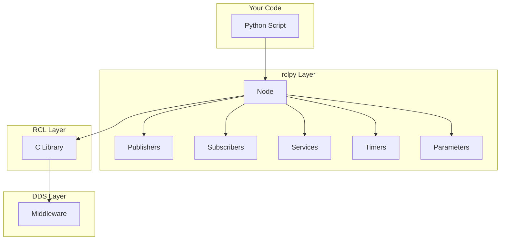

# Chapter 2: Python Client Library (rclpy)

The **rclpy** library is the official Python client for ROS 2. It provides a Pythonic interface to the underlying RCL (ROS Client Library) and enables you to write powerful robot software with clean, readable code.

## Why Python for Robotics?

Python has become a dominant language in robotics for several reasons:

| Advantage | Description |
|-----------|-------------|
| **Rapid Prototyping** | Quick iteration on algorithms and behaviors |
| **Rich Ecosystem** | NumPy, SciPy, OpenCV, TensorFlow, PyTorch |
| **Readability** | Easy to understand and maintain |
| **Integration** | Excellent bindings to C/C++ libraries |

> **Performance Note:** For time-critical code (control loops < 1ms), consider writing in C++ with rclcpp. For most applications, Python is fast enough.

## rclpy Architecture



## Node Lifecycle

Understanding the node lifecycle is crucial for writing robust applications:

### Standard Lifecycle

```python
import rclpy
from rclpy.node import Node

def main():
    # 1. Initialize ROS 2 context
    rclpy.init()
    
    # 2. Create node instance
    node = Node('my_node')
    
    try:
        # 3. Process callbacks
        rclpy.spin(node)
    except KeyboardInterrupt:
        pass
    finally:
        # 4. Cleanup
        node.destroy_node()
        rclpy.shutdown()
```

### Managed Lifecycle Nodes

For production systems, use lifecycle nodes with explicit state transitions:

```python
from rclpy.lifecycle import LifecycleNode, State, TransitionCallbackReturn

class ManagedCamera(LifecycleNode):
    def __init__(self):
        super().__init__('managed_camera')
        self.camera = None
    
    def on_configure(self, state: State) -> TransitionCallbackReturn:
        """Called when transitioning from UNCONFIGURED to INACTIVE"""
        self.get_logger().info('Configuring camera...')
        # Load parameters, allocate resources
        self.camera = CameraDriver(
            self.get_parameter('device_id').value
        )
        return TransitionCallbackReturn.SUCCESS
    
    def on_activate(self, state: State) -> TransitionCallbackReturn:
        """Called when transitioning from INACTIVE to ACTIVE"""
        self.get_logger().info('Activating camera...')
        self.camera.start_streaming()
        return TransitionCallbackReturn.SUCCESS
    
    def on_deactivate(self, state: State) -> TransitionCallbackReturn:
        """Called when transitioning from ACTIVE to INACTIVE"""
        self.camera.stop_streaming()
        return TransitionCallbackReturn.SUCCESS
    
    def on_cleanup(self, state: State) -> TransitionCallbackReturn:
        """Called when transitioning from INACTIVE to UNCONFIGURED"""
        self.camera = None
        return TransitionCallbackReturn.SUCCESS
```

## Creating Publishers and Subscribers

### Complete Publisher Example

```python
#!/usr/bin/env python3
import rclpy
from rclpy.node import Node
from geometry_msgs.msg import TwistStamped
from builtin_interfaces.msg import Time
import math

class CircleDriver(Node):
    """Publishes velocity commands to drive a robot in circles."""
    
    def __init__(self):
        super().__init__('circle_driver')
        
        # Declare parameters with defaults
        self.declare_parameter('linear_speed', 0.5)
        self.declare_parameter('angular_speed', 0.3)
        self.declare_parameter('publish_rate', 20.0)
        
        # Get parameter values
        self.linear_speed = self.get_parameter('linear_speed').value
        self.angular_speed = self.get_parameter('angular_speed').value
        publish_rate = self.get_parameter('publish_rate').value
        
        # Create publisher
        self.cmd_pub = self.create_publisher(
            TwistStamped, 
            '/robot/cmd_vel', 
            10
        )
        
        # Create timer
        timer_period = 1.0 / publish_rate
        self.timer = self.create_timer(timer_period, self.publish_command)
        
        self.get_logger().info(
            f'Circle driver started: linear={self.linear_speed}, '
            f'angular={self.angular_speed}'
        )
    
    def publish_command(self):
        msg = TwistStamped()
        msg.header.stamp = self.get_clock().now().to_msg()
        msg.header.frame_id = 'base_link'
        msg.twist.linear.x = self.linear_speed
        msg.twist.angular.z = self.angular_speed
        self.cmd_pub.publish(msg)

def main(args=None):
    rclpy.init(args=args)
    node = CircleDriver()
    rclpy.spin(node)
    node.destroy_node()
    rclpy.shutdown()

if __name__ == '__main__':
    main()
```

### Complete Subscriber Example

```python
#!/usr/bin/env python3
import rclpy
from rclpy.node import Node
from nav_msgs.msg import Odometry
import numpy as np

class OdometryMonitor(Node):
    """Monitors robot odometry and computes statistics."""
    
    def __init__(self):
        super().__init__('odometry_monitor')
        
        self.subscription = self.create_subscription(
            Odometry,
            '/odom',
            self.odom_callback,
            10
        )
        
        # Statistics tracking
        self.positions = []
        self.velocities = []
        self.start_time = self.get_clock().now()
        
        # Periodic stats output
        self.create_timer(5.0, self.report_stats)
    
    def odom_callback(self, msg: Odometry):
        # Extract position
        pos = msg.pose.pose.position
        self.positions.append([pos.x, pos.y, pos.z])
        
        # Extract velocity
        vel = msg.twist.twist.linear
        speed = np.sqrt(vel.x**2 + vel.y**2 + vel.z**2)
        self.velocities.append(speed)
    
    def report_stats(self):
        if not self.positions:
            return
            
        positions = np.array(self.positions)
        
        # Calculate total distance traveled
        if len(positions) > 1:
            diffs = np.diff(positions, axis=0)
            distances = np.linalg.norm(diffs, axis=1)
            total_distance = np.sum(distances)
        else:
            total_distance = 0.0
        
        # Calculate average speed
        avg_speed = np.mean(self.velocities) if self.velocities else 0.0
        
        self.get_logger().info(
            f'Stats: distance={total_distance:.2f}m, '
            f'avg_speed={avg_speed:.2f}m/s, '
            f'samples={len(self.positions)}'
        )
```

## Working with Parameters

Parameters allow runtime configuration of nodes without code changes.

### Declaring and Using Parameters

```python
class ConfigurableNode(Node):
    def __init__(self):
        super().__init__('configurable_node')
        
        # Declare with type and description
        self.declare_parameter('robot_name', 'default_robot')
        self.declare_parameter('max_speed', 1.0)
        self.declare_parameter('enabled_sensors', ['lidar', 'camera'])
        
        # Get values
        self.robot_name = self.get_parameter('robot_name').value
        self.max_speed = self.get_parameter('max_speed').value
        self.sensors = self.get_parameter('enabled_sensors').value
        
        # Add parameter change callback
        self.add_on_set_parameters_callback(self.on_params_changed)
    
    def on_params_changed(self, params):
        for param in params:
            self.get_logger().info(f'Parameter {param.name} changed to {param.value}')
            
            if param.name == 'max_speed':
                if param.value < 0:
                    return SetParametersResult(
                        successful=False, 
                        reason='Speed must be positive'
                    )
        
        return SetParametersResult(successful=True)
```

### Parameter Files (YAML)

```yaml
# config/robot_params.yaml
configurable_node:
  ros__parameters:
    robot_name: "atlas_01"
    max_speed: 2.5
    enabled_sensors:
      - lidar
      - camera
      - imu
```

### Loading Parameters in Launch

```python
# launch/robot_launch.py
from launch import LaunchDescription
from launch_ros.actions import Node

def generate_launch_description():
    return LaunchDescription([
        Node(
            package='my_robot',
            executable='configurable_node',
            parameters=['config/robot_params.yaml']
        )
    ])
```

## Custom Message Types

When standard messages don't fit your needs, create custom types.

### Defining a Custom Message

```
# msg/RobotStatus.msg
std_msgs/Header header
string robot_id
float32 battery_percentage
bool is_emergency_stopped
geometry_msgs/Pose current_pose
string[] active_tasks
```

### Using Custom Messages

```python
from my_robot_msgs.msg import RobotStatus

class StatusPublisher(Node):
    def __init__(self):
        super().__init__('status_publisher')
        self.pub = self.create_publisher(RobotStatus, '/robot_status', 10)
        self.timer = self.create_timer(1.0, self.publish_status)
    
    def publish_status(self):
        msg = RobotStatus()
        msg.header.stamp = self.get_clock().now().to_msg()
        msg.robot_id = 'atlas_01'
        msg.battery_percentage = 85.5
        msg.is_emergency_stopped = False
        msg.active_tasks = ['navigation', 'mapping']
        self.pub.publish(msg)
```

## Executors and Callbacks

Executors manage how callbacks are scheduled and run.

### Single-Threaded Executor (Default)

```python
rclpy.spin(node)  # Uses SingleThreadedExecutor internally
```

### Multi-Threaded Executor

```python
from rclpy.executors import MultiThreadedExecutor

executor = MultiThreadedExecutor(num_threads=4)
executor.add_node(camera_node)
executor.add_node(perception_node)
executor.add_node(planning_node)

try:
    executor.spin()
finally:
    executor.shutdown()
```

### Callback Groups

```python
from rclpy.callback_groups import ReentrantCallbackGroup, MutuallyExclusiveCallbackGroup

class AdvancedNode(Node):
    def __init__(self):
        super().__init__('advanced_node')
        
        # These callbacks can run concurrently
        self.reentrant_group = ReentrantCallbackGroup()
        
        # Only one callback in this group runs at a time
        self.exclusive_group = MutuallyExclusiveCallbackGroup()
        
        self.create_subscription(
            Image, '/camera', self.image_cb, 10,
            callback_group=self.reentrant_group
        )
        
        self.create_timer(
            0.1, self.control_cb,
            callback_group=self.exclusive_group
        )
```

## Error Handling and Logging

### Logging Levels

```python
self.get_logger().debug('Detailed debugging info')
self.get_logger().info('General information')
self.get_logger().warn('Warning: something might be wrong')
self.get_logger().error('Error: something went wrong')
self.get_logger().fatal('Fatal: system cannot continue')
```

### Throttled Logging

```python
# Only log once per second maximum
self.get_logger().info('Sensor reading', throttle_duration_sec=1.0)
```

### Exception Handling

```python
def safe_callback(self, msg):
    try:
        result = self.process_message(msg)
    except ValueError as e:
        self.get_logger().error(f'Invalid message: {e}')
    except Exception as e:
        self.get_logger().fatal(f'Unexpected error: {e}')
        raise  # Re-raise for debugging
```

## Hands-On Exercise: Pose Tracker

Build a node that:
1. Subscribes to `/odom` (Odometry messages)
2. Computes and publishes a simplified `/robot_pose` (Pose2D)
3. Provides a service to get the current pose
4. Uses parameters for configuration

---

**Next Chapter:** [URDF & TF2](./urdf-humanoids) →
