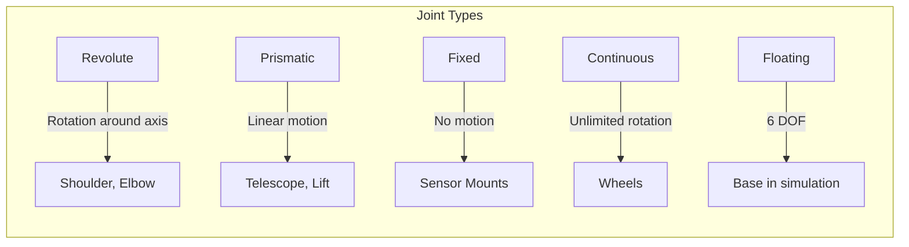
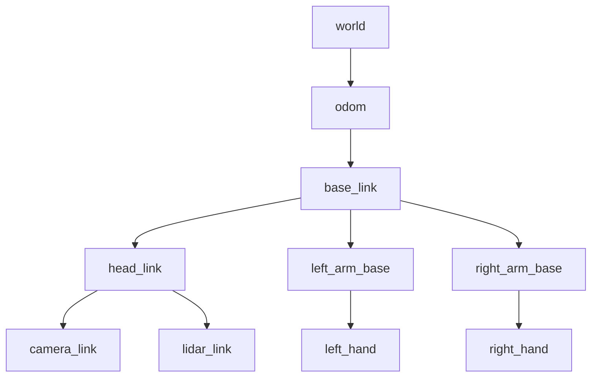

# Chapter 3: URDF & TF2 for Humanoid Robots

Understanding how to describe robot geometry and manage coordinate frames is essential for building any physical AI system. This chapter covers **URDF** (Unified Robot Description Format) and **TF2** (Transform Library 2).

## Why Robot Description Matters

Every robot needs a digital twin - a mathematical model of its physical structure. This model is used for:

- **Visualization:** Displaying the robot in RViz, simulation, and web interfaces
- **Motion Planning:** Computing collision-free paths for arms and legs
- **Kinematics:** Converting between joint angles and end-effector poses
- **Simulation:** Physics-based testing before hardware deployment

## URDF: The Robot Blueprint

URDF is an XML format that describes:

| Element | Description |
|---------|-------------|
| **Links** | Rigid bodies (arms, legs, torso, sensors) |
| **Joints** | Connections between links (revolute, prismatic, fixed) |
| **Visual** | How the robot looks (meshes, colors) |
| **Collision** | Simplified geometry for physics |
| **Inertial** | Mass and inertia for dynamics |

### URDF Structure

```xml
<?xml version="1.0"?>
<robot name="humanoid_robot">
  
  <!-- Base link (torso) -->
  <link name="base_link">
    <visual>
      <geometry>
        <box size="0.3 0.2 0.5"/>
      </geometry>
      <material name="blue">
        <color rgba="0.2 0.4 0.8 1.0"/>
      </material>
    </visual>
    <collision>
      <geometry>
        <box size="0.3 0.2 0.5"/>
      </geometry>
    </collision>
    <inertial>
      <mass value="10.0"/>
      <inertia ixx="0.1" ixy="0" ixz="0" iyy="0.1" iyz="0" izz="0.1"/>
    </inertial>
  </link>
  
  <!-- Head -->
  <link name="head_link">
    <visual>
      <geometry>
        <sphere radius="0.12"/>
      </geometry>
      <material name="gray">
        <color rgba="0.7 0.7 0.7 1.0"/>
      </material>
    </visual>
  </link>
  
  <!-- Neck joint -->
  <joint name="neck_joint" type="revolute">
    <parent link="base_link"/>
    <child link="head_link"/>
    <origin xyz="0 0 0.35" rpy="0 0 0"/>
    <axis xyz="0 0 1"/>
    <limit lower="-1.57" upper="1.57" effort="10" velocity="1.0"/>
  </joint>
  
</robot>
```

### Joint Types



### Complete Humanoid Arm Example

```xml
<!-- Right Arm -->
<link name="right_shoulder_link">
  <visual>
    <geometry>
      <cylinder radius="0.04" length="0.1"/>
    </geometry>
    <origin xyz="0 0 0" rpy="1.5708 0 0"/>
  </visual>
  <inertial>
    <mass value="1.0"/>
    <inertia ixx="0.001" ixy="0" ixz="0" iyy="0.001" iyz="0" izz="0.001"/>
  </inertial>
</link>

<joint name="right_shoulder_pitch" type="revolute">
  <parent link="base_link"/>
  <child link="right_shoulder_link"/>
  <origin xyz="-0.2 0 0.2" rpy="0 0 0"/>
  <axis xyz="0 1 0"/>
  <limit lower="-2.0" upper="2.0" effort="50" velocity="2.0"/>
  <dynamics damping="0.5" friction="0.1"/>
</joint>

<link name="right_upper_arm_link">
  <visual>
    <geometry>
      <cylinder radius="0.03" length="0.25"/>
    </geometry>
    <origin xyz="0 0 -0.125" rpy="0 0 0"/>
  </visual>
</link>

<joint name="right_shoulder_roll" type="revolute">
  <parent link="right_shoulder_link"/>
  <child link="right_upper_arm_link"/>
  <origin xyz="0 0 0" rpy="0 0 0"/>
  <axis xyz="1 0 0"/>
  <limit lower="-1.5" upper="1.5" effort="50" velocity="2.0"/>
</joint>

<link name="right_forearm_link">
  <visual>
    <geometry>
      <cylinder radius="0.025" length="0.22"/>
    </geometry>
    <origin xyz="0 0 -0.11" rpy="0 0 0"/>
  </visual>
</link>

<joint name="right_elbow" type="revolute">
  <parent link="right_upper_arm_link"/>
  <child link="right_forearm_link"/>
  <origin xyz="0 0 -0.25" rpy="0 0 0"/>
  <axis xyz="0 1 0"/>
  <limit lower="0" upper="2.5" effort="40" velocity="2.5"/>
</joint>

<link name="right_hand_link">
  <visual>
    <geometry>
      <box size="0.04 0.08 0.02"/>
    </geometry>
  </visual>
</link>

<joint name="right_wrist" type="revolute">
  <parent link="right_forearm_link"/>
  <child link="right_hand_link"/>
  <origin xyz="0 0 -0.22" rpy="0 0 0"/>
  <axis xyz="0 0 1"/>
  <limit lower="-1.5" upper="1.5" effort="20" velocity="3.0"/>
</joint>
```

### Using Meshes for Visual Fidelity

```xml
<link name="detailed_hand">
  <visual>
    <geometry>
      <mesh filename="package://humanoid_description/meshes/hand.stl" scale="0.001 0.001 0.001"/>
    </geometry>
    <material name="skin">
      <color rgba="0.96 0.87 0.77 1.0"/>
    </material>
  </visual>
  <collision>
    <!-- Simplified collision geometry -->
    <geometry>
      <box size="0.04 0.08 0.02"/>
    </geometry>
  </collision>
</link>
```

## TF2: Coordinate Frame Management

In robotics, every sensor and actuator has its own coordinate frame. TF2 manages the relationships between these frames.

### The Transform Tree



### Publishing Transforms

```python
import rclpy
from rclpy.node import Node
from tf2_ros import TransformBroadcaster
from geometry_msgs.msg import TransformStamped
import math

class HumanoidTFPublisher(Node):
    def __init__(self):
        super().__init__('humanoid_tf_publisher')
        self.tf_broadcaster = TransformBroadcaster(self)
        self.timer = self.create_timer(0.02, self.broadcast_transforms)  # 50 Hz
        
        self.head_yaw = 0.0
    
    def broadcast_transforms(self):
        now = self.get_clock().now().to_msg()
        
        # Broadcast world -> base_link (standing position)
        t = TransformStamped()
        t.header.stamp = now
        t.header.frame_id = 'world'
        t.child_frame_id = 'base_link'
        t.transform.translation.x = 0.0
        t.transform.translation.y = 0.0
        t.transform.translation.z = 1.0  # Standing 1m tall
        t.transform.rotation.w = 1.0  # Identity rotation
        self.tf_broadcaster.sendTransform(t)
        
        # Broadcast base_link -> head_link (dynamic head movement)
        t2 = TransformStamped()
        t2.header.stamp = now
        t2.header.frame_id = 'base_link'
        t2.child_frame_id = 'head_link'
        t2.transform.translation.z = 0.4
        
        # Oscillating head yaw
        self.head_yaw += 0.01
        yaw = 0.3 * math.sin(self.head_yaw)
        t2.transform.rotation.z = math.sin(yaw / 2)
        t2.transform.rotation.w = math.cos(yaw / 2)
        
        self.tf_broadcaster.sendTransform(t2)
```

### Looking Up Transforms

```python
from tf2_ros import Buffer, TransformListener
from tf2_ros import LookupException, ExtrapolationException

class ObjectLocalizer(Node):
    def __init__(self):
        super().__init__('object_localizer')
        
        self.tf_buffer = Buffer()
        self.tf_listener = TransformListener(self.tf_buffer, self)
        
        self.timer = self.create_timer(0.1, self.localize_object)
    
    def localize_object(self):
        try:
            # Get transform from camera to base
            transform = self.tf_buffer.lookup_transform(
                'base_link',      # Target frame
                'camera_link',    # Source frame
                rclpy.time.Time(),  # Latest available
                timeout=rclpy.duration.Duration(seconds=0.1)
            )
            
            self.get_logger().info(
                f'Camera position: ({transform.transform.translation.x:.2f}, '
                f'{transform.transform.translation.y:.2f}, '
                f'{transform.transform.translation.z:.2f})'
            )
            
        except LookupException:
            self.get_logger().warn('Transform not available yet')
        except ExtrapolationException:
            self.get_logger().warn('Transform extrapolation error')
```

### Transforming Points Between Frames

```python
from tf2_geometry_msgs import do_transform_point
from geometry_msgs.msg import PointStamped

def transform_detection_to_base(self, detection_point, transform):
    """Transform a detected object from camera frame to base frame."""
    
    point_camera = PointStamped()
    point_camera.header.frame_id = 'camera_link'
    point_camera.point.x = detection_point[0]
    point_camera.point.y = detection_point[1]
    point_camera.point.z = detection_point[2]
    
    point_base = do_transform_point(point_camera, transform)
    
    return [
        point_base.point.x,
        point_base.point.y,
        point_base.point.z
    ]
```

## Adding Sensors to URDF

### Camera Sensor

```xml
<link name="head_camera_link">
  <visual>
    <geometry>
      <box size="0.02 0.08 0.02"/>
    </geometry>
    <material name="black">
      <color rgba="0.1 0.1 0.1 1.0"/>
    </material>
  </visual>
</link>

<joint name="head_camera_joint" type="fixed">
  <parent link="head_link"/>
  <child link="head_camera_link"/>
  <origin xyz="0.06 0 0" rpy="0 0 0"/>
</joint>

<!-- Gazebo camera plugin -->
<gazebo reference="head_camera_link">
  <sensor type="camera" name="head_camera">
    <update_rate>30.0</update_rate>
    <camera name="head_camera">
      <horizontal_fov>1.3962634</horizontal_fov>
      <image>
        <width>1280</width>
        <height>720</height>
        <format>R8G8B8</format>
      </image>
      <clip>
        <near>0.02</near>
        <far>100</far>
      </clip>
    </camera>
    <plugin name="camera_controller" filename="libgazebo_ros_camera.so">
      <ros>
        <remapping>~/image_raw:=head_camera/image_raw</remapping>
        <remapping>~/camera_info:=head_camera/camera_info</remapping>
      </ros>
      <frame_name>head_camera_link</frame_name>
    </plugin>
  </sensor>
</gazebo>
```

### IMU Sensor

```xml
<link name="imu_link">
  <visual>
    <geometry>
      <box size="0.02 0.02 0.01"/>
    </geometry>
  </visual>
  <inertial>
    <mass value="0.01"/>
    <inertia ixx="0.00001" ixy="0" ixz="0" iyy="0.00001" iyz="0" izz="0.00001"/>
  </inertial>
</link>

<joint name="imu_joint" type="fixed">
  <parent link="base_link"/>
  <child link="imu_link"/>
  <origin xyz="0 0 0" rpy="0 0 0"/>
</joint>

<gazebo reference="imu_link">
  <sensor type="imu" name="base_imu">
    <update_rate>200.0</update_rate>
    <plugin name="imu_controller" filename="libgazebo_ros_imu_sensor.so">
      <ros>
        <remapping>~/out:=imu/data</remapping>
      </ros>
      <frame_name>imu_link</frame_name>
    </plugin>
  </sensor>
</gazebo>
```

## Visualization with RViz

### Launch File for Visualization

```python
from launch import LaunchDescription
from launch_ros.actions import Node
from launch.substitutions import Command
from ament_index_python.packages import get_package_share_directory
import os

def generate_launch_description():
    pkg_path = get_package_share_directory('humanoid_description')
    urdf_file = os.path.join(pkg_path, 'urdf', 'humanoid.urdf')
    
    with open(urdf_file, 'r') as f:
        robot_description = f.read()
    
    return LaunchDescription([
        # Robot state publisher
        Node(
            package='robot_state_publisher',
            executable='robot_state_publisher',
            parameters=[{'robot_description': robot_description}]
        ),
        
        # Joint state publisher GUI
        Node(
            package='joint_state_publisher_gui',
            executable='joint_state_publisher_gui'
        ),
        
        # RViz
        Node(
            package='rviz2',
            executable='rviz2',
            arguments=['-d', os.path.join(pkg_path, 'rviz', 'humanoid.rviz')]
        )
    ])
```

## Key Takeaways

1. **URDF** describes robot structure: links, joints, geometry
2. **TF2** manages coordinate frame transformations
3. Visual geometry can be detailed; collision should be simplified
4. Sensors are added as links with Gazebo plugins
5. RViz visualizes both URDF and TF trees

---

**Module Complete!** Continue to [Module 2: Simulation First](../module-2-simulation/) →
