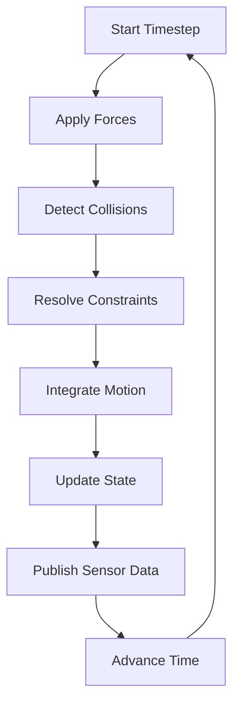

# Chapter 1: Gazebo & Physics Engines

Gazebo is the most widely used open-source robot simulator in the ROS ecosystem. This chapter covers everything you need to build sophisticated simulation environments for your robots.

## Understanding Physics Simulation

Before diving into Gazebo, let's understand what a physics engine actually does:

### The Simulation Loop



### Key Physics Concepts

| Concept | Description | Tuning Impact |
|---------|-------------|---------------|
| **Step Size** | Time per physics update (e.g., 1ms) | Smaller = more accurate, slower |
| **Solver Iterations** | Constraint resolution passes | More = stable, slower |
| **Contact Stiffness** | How "hard" surfaces are | Higher = less penetration |
| **Friction Model** | How surfaces slide | Cone vs. pyramid approximation |
| **Damping** | Energy loss in motion | Higher = more stable, less bouncy |

## Physics Engine Comparison

### Available Engines in Gazebo

```python
# In your world SDF file
<physics type="ode">  # or "bullet", "dart", "simbody"
  <max_step_size>0.001</max_step_size>
  <real_time_factor>1.0</real_time_factor>
  <real_time_update_rate>1000</real_time_update_rate>
</physics>
```

### Engine Characteristics

**ODE (Open Dynamics Engine)**
- ✅ Default engine, very stable
- ✅ Good for wheeled robots
- ❌ Struggles with many contacts

**Bullet**
- ✅ Better multi-contact handling
- ✅ Used in many games
- ❌ Can be less stable

**DART**
- ✅ Best for articulated bodies
- ✅ Excellent for humanoids
- ❌ Higher computational cost

**PhysX (Isaac Sim)**
- ✅ GPU accelerated
- ✅ Best performance
- ❌ NVIDIA hardware required

## Creating Your First Gazebo World

### World File Structure (SDF Format)

```xml
<?xml version="1.0"?>
<sdf version="1.8">
  <world name="robotics_lab">
    
    <!-- Physics Configuration -->
    <physics type="ode">
      <max_step_size>0.001</max_step_size>
      <real_time_update_rate>1000</real_time_update_rate>
      <gravity>0 0 -9.81</gravity>
      <ode>
        <solver>
          <type>quick</type>
          <iters>50</iters>
          <sor>1.3</sor>
        </solver>
        <constraints>
          <cfm>0.0</cfm>
          <erp>0.2</erp>
          <contact_max_correcting_vel>100</contact_max_correcting_vel>
          <contact_surface_layer>0.001</contact_surface_layer>
        </constraints>
      </ode>
    </physics>
    
    <!-- Lighting -->
    <light type="directional" name="sun">
      <cast_shadows>true</cast_shadows>
      <pose>0 0 10 0 0 0</pose>
      <diffuse>0.8 0.8 0.8 1</diffuse>
      <specular>0.2 0.2 0.2 1</specular>
      <attenuation>
        <range>1000</range>
        <constant>0.9</constant>
        <linear>0.01</linear>
        <quadratic>0.001</quadratic>
      </attenuation>
      <direction>-0.5 0.1 -0.9</direction>
    </light>
    
    <!-- Ground Plane -->
    <model name="ground_plane">
      <static>true</static>
      <link name="link">
        <collision name="collision">
          <geometry>
            <plane>
              <normal>0 0 1</normal>
              <size>100 100</size>
            </plane>
          </geometry>
          <surface>
            <friction>
              <ode>
                <mu>100</mu>
                <mu2>50</mu2>
              </ode>
            </friction>
          </surface>
        </collision>
        <visual name="visual">
          <geometry>
            <plane>
              <normal>0 0 1</normal>
              <size>100 100</size>
            </plane>
          </geometry>
          <material>
            <ambient>0.3 0.3 0.3 1</ambient>
            <diffuse>0.7 0.7 0.7 1</diffuse>
          </material>
        </visual>
      </link>
    </model>
    
  </world>
</sdf>
```

### Adding Objects to Your World

```xml
<!-- Table for manipulation tasks -->
<model name="table">
  <static>true</static>
  <pose>2 0 0 0 0 0</pose>
  <link name="link">
    <collision name="collision">
      <geometry>
        <box>
          <size>1.2 0.8 0.75</size>
        </box>
      </geometry>
    </collision>
    <visual name="visual">
      <geometry>
        <box>
          <size>1.2 0.8 0.75</size>
        </box>
      </geometry>
      <material>
        <ambient>0.5 0.3 0.1 1</ambient>
        <diffuse>0.7 0.5 0.2 1</diffuse>
      </material>
    </visual>
  </link>
</model>

<!-- Graspable object -->
<model name="red_cube">
  <pose>2 0 0.8 0 0 0</pose>
  <link name="link">
    <inertial>
      <mass>0.1</mass>
      <inertia>
        <ixx>0.0001</ixx>
        <iyy>0.0001</iyy>
        <izz>0.0001</izz>
      </inertia>
    </inertial>
    <collision name="collision">
      <geometry>
        <box>
          <size>0.05 0.05 0.05</size>
        </box>
      </geometry>
      <surface>
        <friction>
          <ode>
            <mu>0.7</mu>
            <mu2>0.7</mu2>
          </ode>
        </friction>
      </surface>
    </collision>
    <visual name="visual">
      <geometry>
        <box>
          <size>0.05 0.05 0.05</size>
        </box>
      </geometry>
      <material>
        <ambient>0.8 0.1 0.1 1</ambient>
        <diffuse>1.0 0.2 0.2 1</diffuse>
      </material>
    </visual>
  </link>
</model>
```

## Sensor Simulation

### LiDAR Sensor

```xml
<sensor name="lidar" type="gpu_ray">
  <pose>0 0 0.1 0 0 0</pose>
  <ray>
    <scan>
      <horizontal>
        <samples>360</samples>
        <resolution>1</resolution>
        <min_angle>-3.14159</min_angle>
        <max_angle>3.14159</max_angle>
      </horizontal>
      <vertical>
        <samples>16</samples>
        <resolution>1</resolution>
        <min_angle>-0.26</min_angle>
        <max_angle>0.26</max_angle>
      </vertical>
    </scan>
    <range>
      <min>0.1</min>
      <max>30.0</max>
      <resolution>0.01</resolution>
    </range>
    <noise>
      <type>gaussian</type>
      <mean>0.0</mean>
      <stddev>0.01</stddev>
    </noise>
  </ray>
  <update_rate>10</update_rate>
  <plugin name="lidar_plugin" filename="libgazebo_ros_ray_sensor.so">
    <ros>
      <remapping>~/out:=scan</remapping>
    </ros>
    <frame_name>lidar_link</frame_name>
    <output_type>sensor_msgs/PointCloud2</output_type>
  </plugin>
</sensor>
```

### RGB-D Camera

```xml
<sensor name="rgbd_camera" type="depth">
  <update_rate>30</update_rate>
  <camera>
    <horizontal_fov>1.047</horizontal_fov>
    <image>
      <width>640</width>
      <height>480</height>
      <format>R8G8B8</format>
    </image>
    <clip>
      <near>0.1</near>
      <far>10</far>
    </clip>
    <noise>
      <type>gaussian</type>
      <mean>0</mean>
      <stddev>0.007</stddev>
    </noise>
    <depth_camera>
      <output>depths</output>
    </depth_camera>
  </camera>
  <plugin name="rgbd_camera_plugin" filename="libgazebo_ros_camera.so">
    <ros>
      <remapping>~/image_raw:=rgb/image_raw</remapping>
      <remapping>~/depth/image_raw:=depth/image_raw</remapping>
      <remapping>~/camera_info:=rgb/camera_info</remapping>
      <remapping>~/depth/camera_info:=depth/camera_info</remapping>
      <remapping>~/points:=points</remapping>
    </ros>
    <frame_name>camera_link</frame_name>
  </plugin>
</sensor>
```

### IMU Sensor

```xml
<sensor name="imu" type="imu">
  <update_rate>200</update_rate>
  <imu>
    <angular_velocity>
      <x>
        <noise type="gaussian">
          <mean>0</mean>
          <stddev>0.0002</stddev>
        </noise>
      </x>
      <y>
        <noise type="gaussian">
          <mean>0</mean>
          <stddev>0.0002</stddev>
        </noise>
      </y>
      <z>
        <noise type="gaussian">
          <mean>0</mean>
          <stddev>0.0002</stddev>
        </noise>
      </z>
    </angular_velocity>
    <linear_acceleration>
      <x>
        <noise type="gaussian">
          <mean>0</mean>
          <stddev>0.017</stddev>
        </noise>
      </x>
      <y>
        <noise type="gaussian">
          <mean>0</mean>
          <stddev>0.017</stddev>
        </noise>
      </y>
      <z>
        <noise type="gaussian">
          <mean>0</mean>
          <stddev>0.017</stddev>
        </noise>
      </z>
    </linear_acceleration>
  </imu>
  <plugin name="imu_plugin" filename="libgazebo_ros_imu_sensor.so">
    <ros>
      <remapping>~/out:=imu/data</remapping>
    </ros>
    <frame_name>imu_link</frame_name>
  </plugin>
</sensor>
```

## ROS 2 Integration

### Launching Gazebo with ROS 2

```python
# launch/simulation.launch.py
from launch import LaunchDescription
from launch.actions import IncludeLaunchDescription, ExecuteProcess
from launch.launch_description_sources import PythonLaunchDescriptionSource
from launch_ros.actions import Node
from ament_index_python.packages import get_package_share_directory
import os

def generate_launch_description():
    pkg_gazebo_ros = get_package_share_directory('gazebo_ros')
    pkg_my_robot = get_package_share_directory('my_robot')
    
    # World file
    world_file = os.path.join(pkg_my_robot, 'worlds', 'robotics_lab.world')
    
    # Start Gazebo
    gazebo = IncludeLaunchDescription(
        PythonLaunchDescriptionSource(
            os.path.join(pkg_gazebo_ros, 'launch', 'gazebo.launch.py')
        ),
        launch_arguments={'world': world_file}.items()
    )
    
    # Spawn robot
    spawn_robot = Node(
        package='gazebo_ros',
        executable='spawn_entity.py',
        arguments=[
            '-entity', 'my_robot',
            '-file', os.path.join(pkg_my_robot, 'urdf', 'robot.urdf'),
            '-x', '0',
            '-y', '0',
            '-z', '0.1'
        ]
    )
    
    return LaunchDescription([
        gazebo,
        spawn_robot
    ])
```

### The ros_gz_bridge

Bridge topics between Gazebo and ROS 2:

```yaml
# config/bridge.yaml
---
- ros_topic_name: "/cmd_vel"
  gz_topic_name: "/model/robot/cmd_vel"
  ros_type_name: "geometry_msgs/msg/Twist"
  gz_type_name: "gz.msgs.Twist"
  direction: ROS_TO_GZ

- ros_topic_name: "/scan"
  gz_topic_name: "/lidar/scan"
  ros_type_name: "sensor_msgs/msg/LaserScan"
  gz_type_name: "gz.msgs.LaserScan"
  direction: GZ_TO_ROS
```

## Tuning Physics for Realism

### Contact Parameters Guide

```xml
<surface>
  <friction>
    <ode>
      <!-- Coulomb friction coefficients -->
      <mu>0.9</mu>       <!-- Primary direction -->
      <mu2>0.9</mu2>     <!-- Secondary direction -->
      <fdir1>0 0 1</fdir1>  <!-- Friction direction -->
      <slip1>0</slip1>   <!-- Torsional slip -->
      <slip2>0</slip2>
    </ode>
  </friction>
  <contact>
    <ode>
      <soft_cfm>0</soft_cfm>
      <soft_erp>0.2</soft_erp>
      <kp>1e5</kp>      <!-- Contact stiffness -->
      <kd>1</kd>        <!-- Contact damping -->
      <max_vel>0.01</max_vel>
      <min_depth>0.001</min_depth>
    </ode>
  </contact>
</surface>
```

### Performance Optimization Tips

| Tip | Impact |
|-----|--------|
| Use simpler collision meshes | 5-10x faster |
| Reduce solver iterations | 2-3x faster |
| Increase step size (with care) | Proportional |
| Disable shadows | 20-30% faster |
| Use GPU ray sensors | 10x faster for LiDAR |

## Hands-On Exercise

Create a simulation environment for a mobile robot with:
1. A warehouse-like world with shelves
2. LiDAR and camera sensors
3. Spawnable boxes for manipulation
4. Proper friction settings for navigation

---

**Next:** Continue to [Module 3: NVIDIA Isaac](../module-3-isaac/) →
