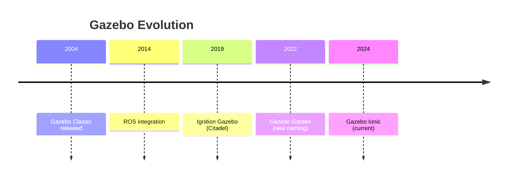
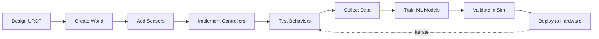

# Module 2: Simulation First

Before we break expensive hardware, we break code in simulation. This module covers the essential tools and methodologies for robot simulation - a practice that has become indispensable in modern robotics development.

## The Case for Simulation

> "In the future, every robot will be trained in simulation before it ever touches the real world." - Jim Keller

### Why Simulation Matters

| Factor | Real Hardware | Simulation |
|--------|--------------|------------|
| **Cost per hour** | $100-1000+ | $0.10-1 (compute only) |
| **Failure consequences** | Damaged robot, injuries | Reset and retry |
| **Speed** | 1x real-time | 10-1000x+ real-time |
| **Reproducibility** | Variable | Perfect repeatability |
| **Parallelization** | 1 robot | 1000s of instances |
| **Scenario coverage** | Limited | Every edge case |

### The Sim-to-Real Gap

The fundamental challenge in simulation is **domain transfer**: policies trained in simulation often fail when deployed to real robots due to:

- **Visual differences:** Perfect rendering vs. real sensor noise
- **Physics discrepancies:** Idealized contacts vs. real-world friction
- **Timing variations:** Deterministic sim vs. non-deterministic reality

We'll cover techniques to minimize this gap throughout this module.

## Learning Objectives

By the end of this module, you will:

1. **Master Gazebo Simulation**
   - Set up complex environments with multiple robots
   - Configure physics parameters and sensor plugins
   - Build custom worlds with obstacles and terrain

2. **Understand Physics Engines**
   - Compare ODE, Bullet, DART, and PhysX
   - Choose the right engine for your application
   - Tune contact models for realistic behavior

3. **Implement Domain Randomization**
   - Vary visual and physical parameters
   - Generate robust policies that transfer to real robots

4. **Run Parallel Simulations**
   - Scale to thousands of instances for RL training
   - Use GPU-accelerated physics with Isaac Sim

## Core Simulation Tools

### Gazebo Classic vs. Ignition Gazebo



**Gazebo Classic (gazebo11)**
- Mature, stable, widely documented
- Tight ROS 1/2 integration
- Being phased out

**Ignition/New Gazebo**
- Modern architecture, better rendering
- Entity-Component-System design
- Long-term future of the project

### Comparison Table

| Feature | Gazebo Classic | New Gazebo | Unity | Isaac Sim |
|---------|---------------|------------|-------|-----------|
| **Physics Engines** | ODE, Bullet, DART | Same + TPE | PhysX | PhysX 5.1 |
| **Rendering** | OGRE | OGRE 2.x | HDRP | RTX ray tracing |
| **ROS 2 Support** | Good | Native | Plugin | Native |
| **GPU Physics** | No | Experimental | Yes | Yes |
| **Learning Curve** | Medium | Medium | High | High |
| **Cost** | Free | Free | Free/Paid | Free* |

*Isaac Sim requires NVIDIA GPU

## Chapter Overview

### Chapter 1: Gazebo & Physics Engines
Deep dive into setting up and configuring Gazebo for robot simulation.

**Topics:**
- World file creation
- Model SDF format
- Physics engine comparison
- Sensor simulation

### Chapter 2: Unity for Robotics
Using game engine technology for photorealistic simulation.

**Topics:**
- Unity Robotics Hub
- ROS-TCP-Connector
- Perception package
- Domain randomization

### Chapter 3: Training in Simulation
Preparing your simulation for reinforcement learning.

**Topics:**
- Parallelization strategies
- Reward shaping
- Curriculum learning
- Sim-to-real transfer

## Prerequisites

- Completed Module 1 (ROS 2 Foundations)
- Ubuntu 22.04 LTS
- At least 16GB RAM
- Discrete GPU recommended (NVIDIA RTX 3060+ for Isaac Sim)

### Installation Quick Start

```bash
# Install Gazebo Harmonic (modern version)
sudo apt-get update
sudo apt-get install ros-humble-ros-gz

# Verify installation
gz sim --version

# Install ROS 2 integration
sudo apt-get install ros-humble-ros-gz-bridge
```

## Simulation Workflow



## Why This Module Matters for Physical AI

Modern AI for robotics follows a simulation-first approach:

1. **Data Generation:** Collect millions of interaction samples
2. **Policy Training:** Train neural networks without hardware risk
3. **Validation:** Test edge cases and failure modes safely
4. **Deployment:** Transfer learned policies to real robots

Companies like Tesla, Boston Dynamics, and 1X all rely heavily on simulation for developing their humanoid robots.

---

**Begin with:** [Chapter 1: Gazebo & Physics Engines](./gazebo-physics) →
