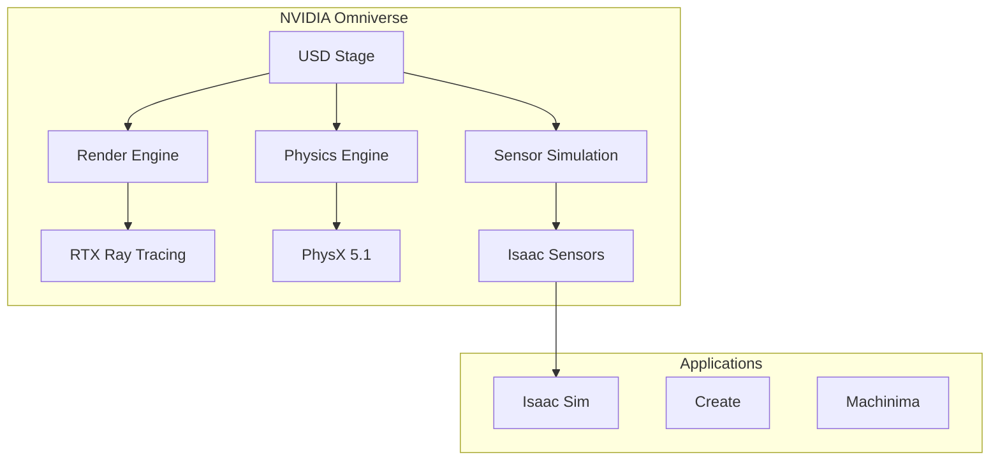
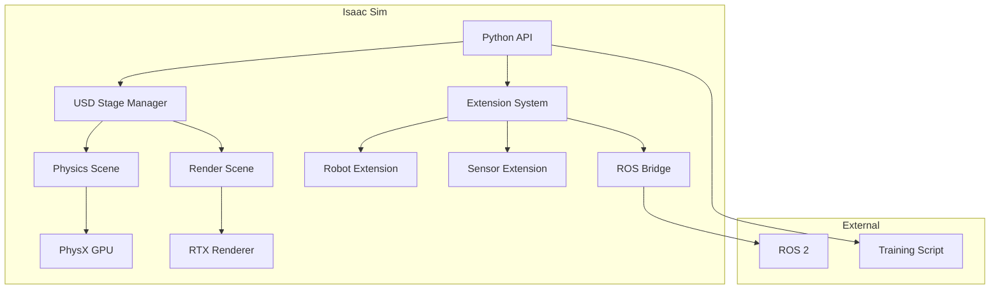

# Module 3: NVIDIA Isaac Platform

NVIDIA Isaac is the most powerful end-to-end robotics platform available today. It provides photorealistic simulation, GPU-accelerated perception, and seamless deployment to real hardware. This module covers the complete Isaac ecosystem.

## Why Isaac?

NVIDIA has built Isaac to be the foundation of modern AI robotics:

| Component | Capability | Use Case |
|-----------|------------|----------|
| **Isaac Sim** | Photorealistic simulation | Training VLA models, synthetic data |
| **Isaac ROS** | GPU-accelerated perception | Real-time SLAM, segmentation |
| **Isaac Gym** | Massively parallel RL | Training locomotion policies |
| **Isaac Lab** | RL research framework | Cutting-edge algorithm development |

### The Power of Omniverse

Isaac Sim is built on **NVIDIA Omniverse**, a platform for creating and operating virtual worlds:



## Learning Objectives

By the end of this module, you will:

1. **Master Isaac Sim**
   - Navigate the Omniverse UI
   - Import robots and create environments
   - Configure advanced physics and sensors
   - Generate synthetic training data

2. **Use Isaac ROS**
   - Deploy GPU-accelerated perception nodes
   - Run real-time SLAM and mapping
   - Integrate with existing ROS 2 pipelines

3. **Train with Isaac Gym**
   - Understand parallel simulation architecture
   - Implement custom environments
   - Train locomotion policies for humanoids

4. **Work with Isaac Lab**
   - Set up RL training pipelines
   - Implement reward functions
   - Deploy trained policies

## System Requirements

> [!WARNING]
> Isaac Sim requires significant hardware resources. Ensure you meet the requirements before proceeding.

### Minimum Specifications

| Component | Requirement |
|-----------|-------------|
| **GPU** | NVIDIA RTX 3060 (12GB VRAM) |
| **CPU** | Intel i7 / AMD Ryzen 7 |
| **RAM** | 32 GB |
| **Storage** | 100 GB SSD |
| **OS** | Ubuntu 22.04 LTS |

### Recommended Specifications

| Component | Requirement |
|-----------|-------------|
| **GPU** | NVIDIA RTX 4080 / A6000 (16GB+ VRAM) |
| **CPU** | Intel i9 / AMD Ryzen 9 |
| **RAM** | 64 GB |
| **Storage** | 500 GB NVMe SSD |
| **OS** | Ubuntu 22.04 LTS |

## Installation Guide

### Step 1: Install Omniverse Launcher

```bash
# Download from NVIDIA website
# https://www.nvidia.com/en-us/omniverse/download/

# Make executable
chmod +x omniverse-launcher-linux.AppImage

# Run launcher
./omniverse-launcher-linux.AppImage
```

### Step 2: Install Isaac Sim

1. Open Omniverse Launcher
2. Navigate to **Exchange** tab
3. Search for "Isaac Sim"
4. Click **Install** (downloads ~15GB)

### Step 3: Configure Environment

```bash
# Add to your ~/.bashrc
export ISAAC_SIM_PATH="${HOME}/.local/share/ov/pkg/isaac-sim-4.0.0"
source ${ISAAC_SIM_PATH}/setup_conda_env.sh

# Create Isaac Sim conda environment
${ISAAC_SIM_PATH}/python.sh -m pip install --upgrade pip
```

### Step 4: Verify Installation

```bash
# Launch Isaac Sim
cd ${ISAAC_SIM_PATH}
./isaac-sim.sh

# Or run headless
./isaac-sim.sh --headless
```

## Isaac Sim Architecture



## Core Isaac Sim Features

### 1. Photorealistic Rendering

Isaac Sim uses RTX ray tracing for accurate sensor simulation:

- **Path-traced rendering:** Accurate lighting for camera sensors
- **Physics-based materials:** PBR textures for realistic surfaces
- **Atmospheric effects:** Fog, dust, and lighting conditions

### 2. Advanced Physics

PhysX 5.1 provides industry-leading simulation:

- **GPU-accelerated rigid body physics**
- **Deformable body simulation**
- **Accurate contact modeling**
- **Articulation support** for complex robots

### 3. Sensor Simulation

Simulation of real-world sensors with noise models:

| Sensor Type | Features |
|-------------|----------|
| **RGB Camera** | RTX rendering, lens distortion, motion blur |
| **Depth Camera** | IR stereo simulation, flying pixels, noise |
| **LiDAR** | Ray-casting, multi-return, intensity |
| **IMU** | Bias, noise, temperature drift |
| **Contact Sensor** | Force/torque measurement |

## Chapter Overview

### Chapter 1: Isaac Sim Deep Dive
Comprehensive guide to Isaac Sim features and workflows.

**Topics:**
- USD scene format
- Robot importing and rigging
- Environment creation
- Sensor configuration

### Chapter 2: Isaac ROS Integration
Connecting Isaac Sim with ROS 2 for real-world deployment.

**Topics:**
- Isaac ROS GEMs
- ROS 2 bridge configuration
- Synthetic data generation

### Chapter 3: Isaac Gym & Lab
Training reinforcement learning policies at scale.

**Topics:**
- Parallel environment setup
- Reward shaping
- Policy deployment

## Quick Start Examples

### Loading a Robot in Python

```python
from omni.isaac.core import World
from omni.isaac.core.robots import Robot

# Create simulation world
world = World(stage_units_in_meters=1.0)

# Add ground plane
world.scene.add_default_ground_plane()

# Load robot from USD
robot = world.scene.add(
    Robot(
        prim_path="/World/Robot",
        name="my_humanoid",
        usd_path="/path/to/humanoid.usd",
        position=[0, 0, 1.0]
    )
)

# Initialize simulation
world.reset()

# Run simulation loop
while True:
    world.step(render=True)
```

### Adding Sensors

```python
from omni.isaac.sensor import Camera, LidarRtx

# Add RGB-D camera
camera = Camera(
    prim_path="/World/Robot/head_camera",
    frequency=30,
    resolution=(1280, 720)
)
camera.initialize()

# Add LiDAR
lidar = LidarRtx(
    prim_path="/World/Robot/lidar",
    min_range=0.1,
    max_range=100.0,
    rotation_frequency=10.0
)
lidar.initialize()
```

### ROS 2 Bridge

```python
from omni.isaac.ros2_bridge import ROS2Publisher

# Create ROS 2 publisher for camera
ros2_camera = ROS2Publisher(
    topic="/head_camera/image_raw",
    msg_type="sensor_msgs/Image",
    source_prim="/World/Robot/head_camera"
)

# Enable bridge
ros2_camera.enable()
```

## Industry Applications

Isaac is used by leading robotics companies:

| Company | Application |
|---------|-------------|
| **Boston Dynamics** | Atlas training |
| **Agility Robotics** | Digit locomotion |
| **1X Technologies** | NEO humanoid development |
| **Figure** | Figure 01 manipulation |
| **Amazon Robotics** | Warehouse automation |

## What's Next?

This module will take you from basics to deploying trained AI policies on real robots. The skills you learn here are directly applicable to state-of-the-art humanoid development.

---

**Begin with:** [Chapter 1: Isaac Sim Deep Dive](./isaac-sim) →
