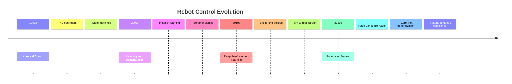
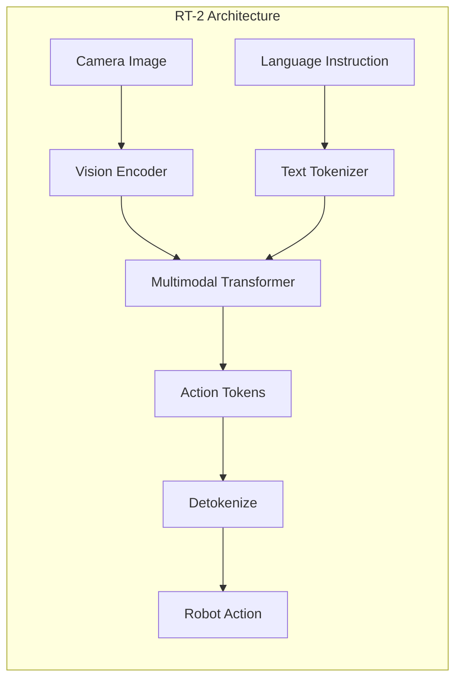
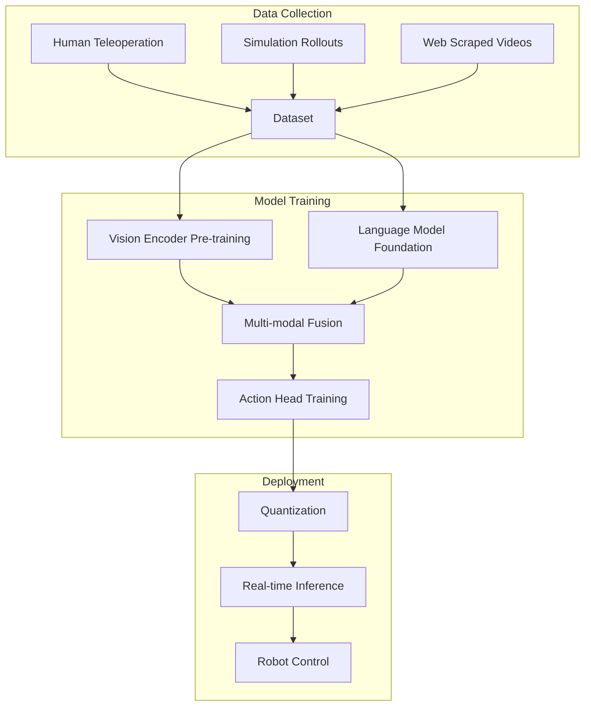
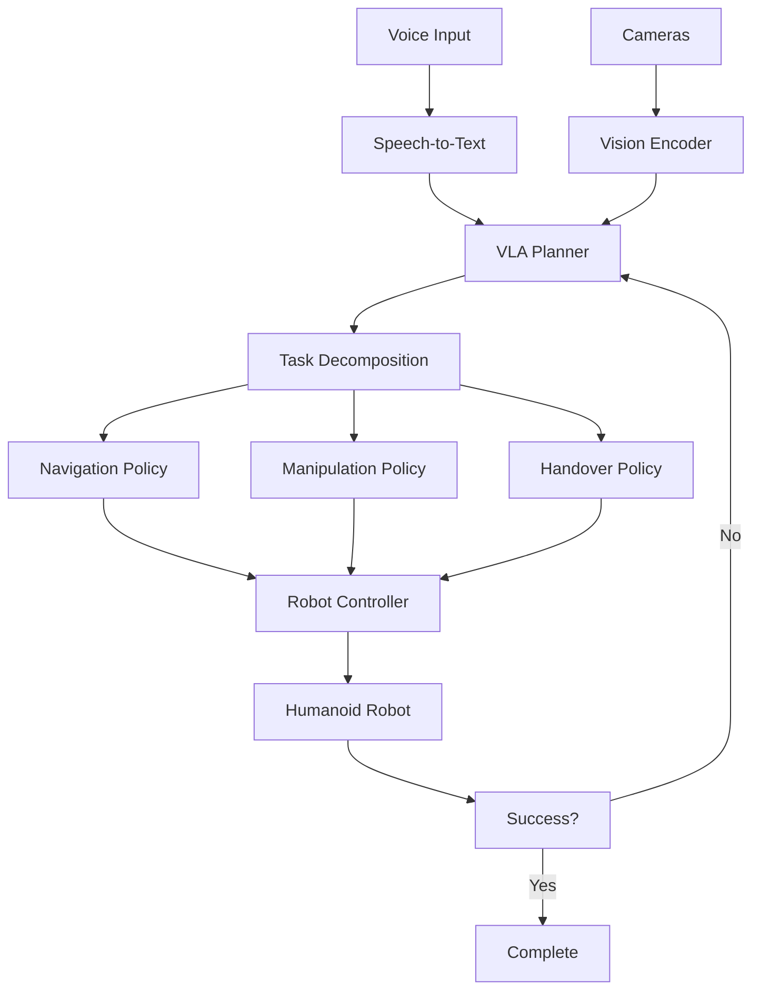

# Module 4: VLA & Humanoids

The frontier of robotics combines Vision, Language, and Action (VLA) into single foundational models. This module covers the cutting-edge research and practical implementation of VLA models for humanoid robots.

## The VLA Revolution

We are at an inflection point in robotics. Just as Large Language Models (LLMs) transformed natural language processing, **Vision-Language-Action (VLA) models** are transforming how robots understand and interact with the physical world.

### The Evolution of Robot Intelligence



### Why VLA Matters

| Traditional Approach | VLA Approach |
|---------------------|--------------|
| Task-specific policies | One model, many tasks |
| Thousands of demonstrations per task | Few-shot learning |
| Explicit state machines | Natural language instructions |
| Limited generalization | Semantic understanding |
| Brittle to variations | Robust to novel scenarios |

## Learning Objectives

By the end of this module, you will:

1. **Understand VLA Architecture**
   - Transformer foundations for robotics
   - Vision encoders and action decoders
   - Multi-modal fusion strategies

2. **Implement VLA Pipelines**
   - Data collection for VLA training
   - Fine-tuning foundation models
   - Evaluation methodologies

3. **Deploy to Humanoid Robots**
   - Real-time inference optimization
   - Safety constraints and monitoring
   - Human-robot interaction patterns

4. **Build a Complete System**
   - Voice command interface
   - Visual grounding
   - Manipulation execution

## Key VLA Architectures

### RT-2 (Robotics Transformer 2)

Google DeepMind's groundbreaking model that treats robot actions as text tokens:



**Key Innovation:** Actions are represented as strings like `"0.23, -0.15, 0.02, 0.5, 0, 1"` and generated autoregressively like text.

### PaLM-E

A 562-billion parameter embodied multimodal model:

- Combines a vision encoder with PaLM language model
- Can reason about objects, spatial relationships, and physics
- Enables complex, multi-step task planning

### OpenVLA

Open-source VLA research platform:

```python
# OpenVLA inference example
from openvla import VLAPolicy

policy = VLAPolicy.from_pretrained("openvla-7b")

# Get observation
image = camera.get_rgb()
instruction = "Pick up the red apple from the table"

# Predict action
action = policy.predict(
    image=image,
    instruction=instruction
)

# Execute on robot
robot.execute_action(action)
```

## How VLA Works

### The Training Pipeline



### Action Representation

VLA models must output continuous robot actions. Common approaches:

| Method | Description | Pros/Cons |
|--------|-------------|-----------|
| **Discretization** | Bin continuous actions into tokens | Simple but loses precision |
| **Diffusion** | Generate actions via denoising | High quality, slower |
| **Continuous Heads** | Regression on action space | Fast, requires careful training |
| **Flow Matching** | Learn action distribution flow | State-of-the-art, complex |

### Example Action Tokenization

```python
# RT-2 style action tokenization
def tokenize_action(action, num_bins=256):
    """Convert continuous action to tokens."""
    # Normalize to [0, 1]
    action_normalized = (action - action_min) / (action_max - action_min)
    
    # Discretize
    tokens = (action_normalized * (num_bins - 1)).astype(int)
    
    # Convert to string tokens
    token_strings = [f"<action_{i}_{t}>" for i, t in enumerate(tokens)]
    
    return " ".join(token_strings)

# Example output: "<action_0_128> <action_1_64> <action_2_200> ..."
```

## Humanoid Robot Platforms

### Leading Humanoid Robots

| Robot | Company | Key Features | VLA Integration |
|-------|---------|--------------|-----------------|
| **Atlas** | Boston Dynamics | Dynamic bipedal, parkour | Internal research |
| **Optimus** | Tesla | Manufacturing focus | Tesla FSD-derived |
| **Figure 01/02** | Figure AI | General purpose | OpenAI partnership |
| **Digit** | Agility Robotics | Warehouse logistics | Production deployed |
| **NEO** | 1X Technologies | Safe human interaction | Open collaboration |
| **GR-1** | Fourier Intelligence | Rehabilitation focus | Research partner |

### Humanoid Morphology for VLA

Humanoid robots are ideal for VLA because:

1. **Shared Morphology:** Human demonstrations transfer better
2. **Tool Use:** Can use human-designed tools and interfaces
3. **Navigation:** Designed for human environments
4. **Communication:** Natural gesture and expression

```python
# Humanoid action space example
class HumanoidAction:
    # Head (3 DOF)
    head_yaw: float      # -90 to 90 degrees
    head_pitch: float    # -45 to 45 degrees
    head_roll: float     # -30 to 30 degrees
    
    # Arms (7 DOF each)
    left_arm: np.ndarray   # 7 joint angles
    right_arm: np.ndarray  # 7 joint angles
    
    # Hands (variable DOF)
    left_gripper: float    # 0 to 1 (open to closed)
    right_gripper: float
    
    # Locomotion
    base_linear_velocity: np.ndarray  # [vx, vy]
    base_angular_velocity: float       # omega_z
```

## Building Your VLA System

### Data Collection Infrastructure

```python
from dataclasses import dataclass
import numpy as np

@dataclass
class VLAObservation:
    """Multi-modal observation for VLA."""
    # Visual observations
    head_rgb: np.ndarray          # (H, W, 3)
    head_depth: np.ndarray        # (H, W)
    wrist_rgb: np.ndarray         # (H, W, 3)
    
    # Proprioception
    joint_positions: np.ndarray    # All joint angles
    joint_velocities: np.ndarray   # All joint velocities
    ee_pose: np.ndarray           # End effector 6DOF pose
    
    # Language
    instruction: str               # Natural language command

@dataclass
class VLAAction:
    """Humanoid action output."""
    joint_position_targets: np.ndarray  # Target joint positions
    gripper_commands: np.ndarray        # [left, right] open/close
    base_velocity: np.ndarray           # [vx, vy, omega]

class VLADataCollector:
    """Collect demonstrations for VLA training."""
    
    def __init__(self, robot, cameras):
        self.robot = robot
        self.cameras = cameras
        self.trajectories = []
        self.current_trajectory = []
        
    def record_step(self, instruction: str):
        """Record a single timestep."""
        obs = VLAObservation(
            head_rgb=self.cameras['head'].get_rgb(),
            head_depth=self.cameras['head'].get_depth(),
            wrist_rgb=self.cameras['wrist'].get_rgb(),
            joint_positions=self.robot.get_joint_positions(),
            joint_velocities=self.robot.get_joint_velocities(),
            ee_pose=self.robot.get_ee_pose(),
            instruction=instruction
        )
        
        action = VLAAction(
            joint_position_targets=self.robot.get_commanded_positions(),
            gripper_commands=self.robot.get_gripper_state(),
            base_velocity=self.robot.get_base_velocity()
        )
        
        self.current_trajectory.append((obs, action))
    
    def save_trajectory(self, task_name: str):
        """Save completed trajectory to disk."""
        trajectory_data = {
            'task': task_name,
            'observations': [t[0] for t in self.current_trajectory],
            'actions': [t[1] for t in self.current_trajectory],
            'length': len(self.current_trajectory)
        }
        
        self.trajectories.append(trajectory_data)
        self.current_trajectory = []
        
        # Save to file
        np.save(f"trajectories/{task_name}_{len(self.trajectories)}.npy", 
                trajectory_data)
```

### VLA Inference Pipeline

```python
import torch
from transformers import AutoModel, AutoProcessor

class VLAInferenceEngine:
    """Real-time VLA inference for humanoid control."""
    
    def __init__(self, model_path: str, device: str = "cuda"):
        self.device = device
        
        # Load model
        self.model = AutoModel.from_pretrained(model_path).to(device)
        self.processor = AutoProcessor.from_pretrained(model_path)
        
        # Compile for speed
        self.model = torch.compile(self.model)
        
        # Warm up
        self._warmup()
    
    def _warmup(self):
        """Warm up the model with dummy inputs."""
        dummy_image = torch.zeros(1, 3, 224, 224).to(self.device)
        dummy_text = "dummy instruction"
        
        with torch.no_grad():
            for _ in range(3):
                self.predict(dummy_image, dummy_text)
    
    @torch.inference_mode()
    def predict(self, image: torch.Tensor, instruction: str) -> np.ndarray:
        """Generate action from observation and instruction."""
        
        # Process inputs
        inputs = self.processor(
            images=image,
            text=instruction,
            return_tensors="pt"
        ).to(self.device)
        
        # Generate action tokens
        outputs = self.model.generate(
            **inputs,
            max_new_tokens=32,
            do_sample=False
        )
        
        # Decode action
        action_text = self.processor.decode(outputs[0])
        action = self._parse_action(action_text)
        
        return action
    
    def _parse_action(self, action_text: str) -> np.ndarray:
        """Parse action string to numpy array."""
        # Example format: "action: [0.1, -0.2, 0.3, 0.5, 0.1, -0.1, 0.0]"
        import re
        numbers = re.findall(r"[-+]?\d*\.\d+|\d+", action_text)
        return np.array([float(n) for n in numbers])
```

## Capstone Project: Butler Bot

Throughout this module, you'll build a complete "Butler Bot" system that can:

1. **Understand Commands:** "Please bring me the water bottle from the kitchen"
2. **Navigate:** Plan and execute path to kitchen
3. **Locate Objects:** Find the water bottle using vision
4. **Manipulate:** Pick up the bottle safely
5. **Deliver:** Return and hand over the object

### System Architecture



## Prerequisites

- Completed Modules 1-3
- Understanding of transformers and attention
- Basic PyTorch/TensorFlow experience
- Access to GPU (8GB+ VRAM) for inference

## Resources

- 📄 [RT-2 Paper](https://arxiv.org/abs/2307.15818)
- 📄 [PaLM-E Paper](https://arxiv.org/abs/2303.03378)
- 💻 [OpenVLA GitHub](https://github.com/openvla/openvla)
- 📚 [LeRobot Framework](https://github.com/huggingface/lerobot)

---

**Begin with:** [Chapter 1: Voice to Action Pipeline](./voice-to-action) →
