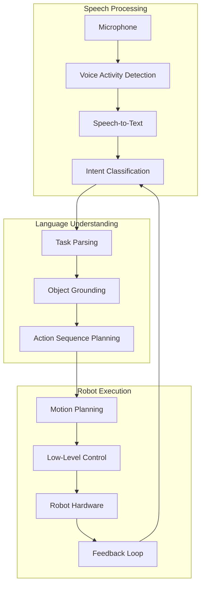

# Chapter 1: Voice to Action Pipeline

This chapter walks through building a complete voice-to-action pipeline for humanoid robots. We'll create a system where a user can speak natural language commands that are understood and executed by the robot.

## System Overview

The voice-to-action pipeline consists of several interconnected components:



## Speech Recognition

### Real-Time Speech-to-Text

We'll use OpenAI's Whisper for robust speech recognition:

```python
import whisper
import sounddevice as sd
import numpy as np
from queue import Queue
import threading

class RealtimeSpeechRecognizer:
    """Real-time speech recognition using Whisper."""
    
    def __init__(self, model_size: str = "base"):
        # Load Whisper model
        self.model = whisper.load_model(model_size)
        
        # Audio parameters
        self.sample_rate = 16000
        self.chunk_duration = 2.0  # seconds
        
        # Buffers
        self.audio_queue = Queue()
        self.is_recording = False
        
    def start(self):
        """Start continuous recognition."""
        self.is_recording = True
        
        # Start audio capture thread
        self.capture_thread = threading.Thread(target=self._capture_audio)
        self.capture_thread.start()
        
        # Start recognition thread
        self.recognition_thread = threading.Thread(target=self._process_audio)
        self.recognition_thread.start()
    
    def stop(self):
        """Stop recognition."""
        self.is_recording = False
        self.capture_thread.join()
        self.recognition_thread.join()
    
    def _capture_audio(self):
        """Capture audio from microphone."""
        def callback(indata, frames, time, status):
            if status:
                print(f"Audio capture error: {status}")
            self.audio_queue.put(indata.copy())
        
        with sd.InputStream(
            samplerate=self.sample_rate,
            channels=1,
            callback=callback,
            blocksize=int(self.sample_rate * self.chunk_duration)
        ):
            while self.is_recording:
                sd.sleep(100)
    
    def _process_audio(self):
        """Process audio chunks and transcribe."""
        buffer = np.array([], dtype=np.float32)
        
        while self.is_recording:
            if not self.audio_queue.empty():
                chunk = self.audio_queue.get()
                buffer = np.concatenate([buffer, chunk.flatten()])
                
                # Process when we have enough audio
                if len(buffer) >= self.sample_rate * 3:
                    # Transcribe
                    result = self.model.transcribe(
                        buffer, 
                        language="en",
                        fp16=False
                    )
                    
                    text = result["text"].strip()
                    if text:
                        self.on_transcription(text)
                    
                    # Keep last second for overlap
                    buffer = buffer[-self.sample_rate:]
    
    def on_transcription(self, text: str):
        """Override this to handle transcriptions."""
        print(f"Transcribed: {text}")
```

### Voice Activity Detection

Only process audio when someone is speaking:

```python
import webrtcvad
import collections

class VoiceActivityDetector:
    """Detect when voice is present in audio."""
    
    def __init__(self, aggressiveness: int = 2):
        self.vad = webrtcvad.Vad(aggressiveness)  # 0-3, higher = more aggressive
        self.sample_rate = 16000
        self.frame_duration_ms = 30
        self.padding_duration_ms = 300
        
        # Ring buffer for smoothing
        num_padding_frames = int(self.padding_duration_ms / self.frame_duration_ms)
        self.ring_buffer = collections.deque(maxlen=num_padding_frames)
        
        self.triggered = False
        self.voiced_frames = []
        
    def process_frame(self, frame: bytes) -> tuple[bool, bytes | None]:
        """Process a single audio frame.
        
        Returns:
            (is_speaking, complete_utterance or None)
        """
        is_speech = self.vad.is_speech(frame, self.sample_rate)
        
        if not self.triggered:
            self.ring_buffer.append((frame, is_speech))
            
            # Check if we should start
            num_voiced = len([f for f, speech in self.ring_buffer if speech])
            if num_voiced > 0.9 * self.ring_buffer.maxlen:
                self.triggered = True
                # Add buffered frames
                for f, s in self.ring_buffer:
                    self.voiced_frames.append(f)
                self.ring_buffer.clear()
        else:
            self.voiced_frames.append(frame)
            self.ring_buffer.append((frame, is_speech))
            
            # Check if we should stop
            num_unvoiced = len([f for f, speech in self.ring_buffer if not speech])
            if num_unvoiced > 0.9 * self.ring_buffer.maxlen:
                self.triggered = False
                utterance = b''.join(self.voiced_frames)
                self.voiced_frames = []
                return False, utterance
        
        return self.triggered, None
```

## Language Understanding

### Intent Classification

Map natural language to robot intents:

```python
from transformers import pipeline
from dataclasses import dataclass
from typing import List, Optional

@dataclass
class RobotIntent:
    action: str              # "pick", "place", "navigate", "wave", etc.
    objects: List[str]       # Target objects
    locations: List[str]     # Target locations
    modifiers: dict          # Additional parameters
    confidence: float

class IntentClassifier:
    """Classify user commands into robot intents."""
    
    def __init__(self):
        self.classifier = pipeline(
            "zero-shot-classification",
            model="facebook/bart-large-mnli"
        )
        
        # Define possible intents
        self.intent_labels = [
            "pick up object",
            "place object",
            "navigate to location",
            "hand over object",
            "wave greeting",
            "point at object",
            "follow person",
            "stop current action"
        ]
        
    def classify(self, text: str) -> RobotIntent:
        """Classify text into a robot intent."""
        
        # Get intent
        result = self.classifier(text, self.intent_labels)
        top_intent = result["labels"][0]
        confidence = result["scores"][0]
        
        # Extract entities
        objects = self._extract_objects(text)
        locations = self._extract_locations(text)
        modifiers = self._extract_modifiers(text)
        
        return RobotIntent(
            action=self._normalize_action(top_intent),
            objects=objects,
            locations=locations,
            modifiers=modifiers,
            confidence=confidence
        )
    
    def _normalize_action(self, intent: str) -> str:
        """Convert intent label to action command."""
        mapping = {
            "pick up object": "pick",
            "place object": "place",
            "navigate to location": "navigate",
            "hand over object": "handover",
            "wave greeting": "wave",
            "point at object": "point",
            "follow person": "follow",
            "stop current action": "stop"
        }
        return mapping.get(intent, "unknown")
    
    def _extract_objects(self, text: str) -> List[str]:
        """Extract object mentions from text."""
        # Use NER or keyword matching
        common_objects = [
            "apple", "bottle", "cup", "phone", "book", "pen",
            "plate", "fork", "knife", "spoon", "ball", "toy"
        ]
        found = [obj for obj in common_objects if obj in text.lower()]
        return found if found else ["object"]
    
    def _extract_locations(self, text: str) -> List[str]:
        """Extract location mentions from text."""
        common_locations = [
            "table", "kitchen", "shelf", "counter", "floor",
            "desk", "drawer", "fridge", "here", "there"
        ]
        found = [loc for loc in common_locations if loc in text.lower()]
        return found if found else []
    
    def _extract_modifiers(self, text: str) -> dict:
        """Extract action modifiers."""
        modifiers = {}
        
        if "carefully" in text.lower() or "gently" in text.lower():
            modifiers["speed"] = "slow"
        if "quickly" in text.lower() or "fast" in text.lower():
            modifiers["speed"] = "fast"
        if "left" in text.lower():
            modifiers["hand"] = "left"
        if "right" in text.lower():
            modifiers["hand"] = "right"
            
        return modifiers
```

### Task Decomposition with LLMs

Use an LLM to break complex commands into executable steps:

```python
from openai import OpenAI

class TaskDecomposer:
    """Decompose high-level commands into action sequences."""
    
    def __init__(self):
        self.client = OpenAI()
        
        self.system_prompt = """You are a task planner for a humanoid robot.
Given a high-level command, break it down into a sequence of primitive actions.

Available primitive actions:
- navigate(location): Move to a location
- locate(object): Find an object using vision
- pick(object, hand): Grasp an object
- place(location): Put down held object
- handover(): Extend arm for human to take object
- speak(text): Say something
- wait(seconds): Pause execution

Output a JSON list of actions with parameters.
Be specific and include error handling steps."""

    def decompose(self, command: str, context: dict = None) -> List[dict]:
        """Decompose command into action sequence."""
        
        user_message = f"Command: {command}"
        if context:
            user_message += f"\nContext: {context}"
        
        response = self.client.chat.completions.create(
            model="gpt-4",
            messages=[
                {"role": "system", "content": self.system_prompt},
                {"role": "user", "content": user_message}
            ],
            response_format={"type": "json_object"}
        )
        
        import json
        actions = json.loads(response.choices[0].message.content)
        return actions.get("actions", [])

# Example usage
decomposer = TaskDecomposer()
actions = decomposer.decompose("Bring me a water bottle from the kitchen")

# Output:
# [
#   {"action": "speak", "params": {"text": "Sure, I'll get you a water bottle."}},
#   {"action": "navigate", "params": {"location": "kitchen"}},
#   {"action": "locate", "params": {"object": "water bottle"}},
#   {"action": "pick", "params": {"object": "water bottle", "hand": "right"}},
#   {"action": "navigate", "params": {"location": "user_location"}},
#   {"action": "handover", "params": {}},
#   {"action": "speak", "params": {"text": "Here's your water bottle."}}
# ]
```

## Visual Grounding

### Object Detection and Localization

Use vision models to find objects in the scene:

```python
import torch
from transformers import OwlViTProcessor, OwlViTForObjectDetection
from PIL import Image
import numpy as np

class ObjectLocalizer:
    """Locate objects in camera images using language queries."""
    
    def __init__(self):
        self.processor = OwlViTProcessor.from_pretrained("google/owlvit-base-patch32")
        self.model = OwlViTForObjectDetection.from_pretrained("google/owlvit-base-patch32")
        self.model.eval()
        
        if torch.cuda.is_available():
            self.model = self.model.cuda()
    
    def find_object(
        self, 
        image: np.ndarray, 
        object_name: str,
        threshold: float = 0.1
    ) -> List[dict]:
        """Find object in image.
        
        Returns:
            List of detections with bounding boxes and confidence
        """
        # Convert to PIL
        pil_image = Image.fromarray(image)
        
        # Prepare text queries
        texts = [[f"a photo of a {object_name}"]]
        
        # Process
        inputs = self.processor(text=texts, images=pil_image, return_tensors="pt")
        if torch.cuda.is_available():
            inputs = {k: v.cuda() for k, v in inputs.items()}
        
        # Inference
        with torch.no_grad():
            outputs = self.model(**inputs)
        
        # Post-process
        target_sizes = torch.tensor([pil_image.size[::-1]])
        if torch.cuda.is_available():
            target_sizes = target_sizes.cuda()
            
        results = self.processor.post_process_object_detection(
            outputs=outputs,
            target_sizes=target_sizes,
            threshold=threshold
        )[0]
        
        detections = []
        for score, box in zip(results["scores"], results["boxes"]):
            detections.append({
                "object": object_name,
                "confidence": score.item(),
                "bbox": box.cpu().numpy().tolist(),  # [x1, y1, x2, y2]
                "center": self._box_center(box.cpu().numpy())
            })
        
        return sorted(detections, key=lambda x: -x["confidence"])
    
    def _box_center(self, box: np.ndarray) -> tuple:
        """Get center of bounding box."""
        x1, y1, x2, y2 = box
        return ((x1 + x2) / 2, (y1 + y2) / 2)
```

### 3D Object Pose Estimation

Convert 2D detections to 3D poses for manipulation:

```python
import numpy as np
from typing import Tuple

class ObjectPoseEstimator:
    """Estimate 3D object poses from RGB-D data."""
    
    def __init__(self, camera_intrinsics: np.ndarray):
        self.K = camera_intrinsics  # 3x3 intrinsic matrix
        
    def get_3d_pose(
        self,
        bbox_center: Tuple[float, float],
        depth_image: np.ndarray,
        rgb_image: np.ndarray = None
    ) -> np.ndarray:
        """Get 3D position of object.
        
        Args:
            bbox_center: (u, v) pixel coordinates
            depth_image: Depth image in meters
            
        Returns:
            3D position [x, y, z] in camera frame
        """
        u, v = int(bbox_center[0]), int(bbox_center[1])
        
        # Sample depth around center for robustness
        h, w = depth_image.shape
        u = np.clip(u, 5, w - 5)
        v = np.clip(v, 5, h - 5)
        
        # Get median depth in region
        region = depth_image[v-5:v+5, u-5:u+5]
        valid_depths = region[region > 0]
        
        if len(valid_depths) == 0:
            raise ValueError("No valid depth at object location")
        
        z = np.median(valid_depths)
        
        # Back-project to 3D
        fx, fy = self.K[0, 0], self.K[1, 1]
        cx, cy = self.K[0, 2], self.K[1, 2]
        
        x = (u - cx) * z / fx
        y = (v - cy) * z / fy
        
        return np.array([x, y, z])
    
    def transform_to_base(
        self,
        point_camera: np.ndarray,
        camera_to_base: np.ndarray
    ) -> np.ndarray:
        """Transform point from camera frame to robot base frame.
        
        Args:
            point_camera: 3D point in camera frame
            camera_to_base: 4x4 transform matrix
            
        Returns:
            3D point in base frame
        """
        point_homogeneous = np.append(point_camera, 1.0)
        point_base = camera_to_base @ point_homogeneous
        return point_base[:3]
```

## Action Execution

### Motion Primitives

Implement reusable motion primitives:

```python
from abc import ABC, abstractmethod
from enum import Enum
import numpy as np

class MotionStatus(Enum):
    RUNNING = "running"
    SUCCESS = "success"
    FAILED = "failed"

class MotionPrimitive(ABC):
    """Base class for motion primitives."""
    
    @abstractmethod
    def start(self, robot, params: dict) -> None:
        """Initialize the motion."""
        pass
    
    @abstractmethod
    def step(self, robot) -> MotionStatus:
        """Execute one step of the motion."""
        pass
    
    @abstractmethod
    def stop(self, robot) -> None:
        """Emergency stop."""
        pass

class PickMotion(MotionPrimitive):
    """Pick up an object."""
    
    def __init__(self):
        self.phase = "approach"  # approach, grasp, lift
        self.target_pose = None
        
    def start(self, robot, params: dict) -> None:
        self.object_pose = params["object_pose"]
        self.hand = params.get("hand", "right")
        
        # Compute approach pose (10cm above object)
        self.approach_pose = self.object_pose.copy()
        self.approach_pose[2] += 0.10
        
        self.phase = "approach"
        robot.open_gripper(self.hand)
    
    def step(self, robot) -> MotionStatus:
        current_ee = robot.get_ee_pose(self.hand)
        
        if self.phase == "approach":
            # Move to approach pose
            error = np.linalg.norm(current_ee[:3] - self.approach_pose)
            robot.move_ee_towards(self.approach_pose, self.hand)
            
            if error < 0.01:  # 1cm threshold
                self.phase = "descend"
                return MotionStatus.RUNNING
                
        elif self.phase == "descend":
            # Move down to grasp
            error = np.linalg.norm(current_ee[:3] - self.object_pose)
            robot.move_ee_towards(self.object_pose, self.hand)
            
            if error < 0.01:
                self.phase = "grasp"
                return MotionStatus.RUNNING
                
        elif self.phase == "grasp":
            # Close gripper
            robot.close_gripper(self.hand)
            
            if robot.is_gripper_closed(self.hand):
                self.phase = "lift"
                return MotionStatus.RUNNING
                
        elif self.phase == "lift":
            # Lift object
            robot.move_ee_towards(self.approach_pose, self.hand)
            error = np.linalg.norm(current_ee[:3] - self.approach_pose)
            
            if error < 0.01:
                return MotionStatus.SUCCESS
        
        return MotionStatus.RUNNING
    
    def stop(self, robot) -> None:
        robot.stop_motion()
```

### Complete Pipeline Integration

```python
class VoiceToActionPipeline:
    """Complete voice-to-action system."""
    
    def __init__(self, robot):
        self.robot = robot
        self.speech = RealtimeSpeechRecognizer()
        self.intent_classifier = IntentClassifier()
        self.task_decomposer = TaskDecomposer()
        self.object_localizer = ObjectLocalizer()
        self.motion_primitives = {
            "pick": PickMotion(),
            "place": PlaceMotion(),
            "navigate": NavigateMotion(),
            "handover": HandoverMotion()
        }
        
        # Current state
        self.current_task = None
        self.action_queue = []
    
    def run(self):
        """Main loop."""
        self.speech.on_transcription = self.handle_command
        self.speech.start()
        
        try:
            while True:
                if self.action_queue:
                    self.execute_next_action()
                else:
                    time.sleep(0.1)
        finally:
            self.speech.stop()
    
    def handle_command(self, text: str):
        """Handle incoming voice command."""
        print(f"Received command: {text}")
        
        # Classify intent
        intent = self.intent_classifier.classify(text)
        print(f"Intent: {intent.action} (confidence: {intent.confidence:.2f})")
        
        if intent.confidence < 0.5:
            self.robot.speak("I didn't understand that. Could you repeat?")
            return
        
        # Decompose into actions
        actions = self.task_decomposer.decompose(text)
        self.action_queue.extend(actions)
        
        # Start execution
        self.robot.speak(f"Got it. I'll {intent.action} the {intent.objects[0]}.")
    
    def execute_next_action(self):
        """Execute the next action in queue."""
        if not self.action_queue:
            return
        
        action = self.action_queue[0]
        primitive = self.motion_primitives.get(action["action"])
        
        if primitive is None:
            print(f"Unknown action: {action['action']}")
            self.action_queue.pop(0)
            return
        
        # Initialize if needed
        if self.current_task is None:
            self.current_task = primitive
            self.setup_action(primitive, action["params"])
        
        # Step execution
        status = self.current_task.step(self.robot)
        
        if status == MotionStatus.SUCCESS:
            print(f"Action {action['action']} completed")
            self.action_queue.pop(0)
            self.current_task = None
        elif status == MotionStatus.FAILED:
            print(f"Action {action['action']} failed")
            self.action_queue.clear()
            self.current_task = None
            self.robot.speak("Sorry, I couldn't complete that action.")
    
    def setup_action(self, primitive, params: dict):
        """Setup action with resolved parameters."""
        # Handle object localization
        if "object" in params:
            rgb = self.robot.get_camera_image()
            depth = self.robot.get_depth_image()
            
            detections = self.object_localizer.find_object(rgb, params["object"])
            
            if not detections:
                raise ValueError(f"Could not find {params['object']}")
            
            # Get 3D pose
            center = detections[0]["center"]
            pose = self.pose_estimator.get_3d_pose(center, depth, rgb)
            pose = self.pose_estimator.transform_to_base(
                pose, 
                self.robot.get_camera_transform()
            )
            
            params["object_pose"] = pose
        
        primitive.start(self.robot, params)
```

## Summary

In this chapter, you learned how to build a complete voice-to-action pipeline:

1. **Speech Recognition:** Real-time transcription with Whisper and VAD
2. **Intent Classification:** Zero-shot classification of user commands
3. **Task Decomposition:** Using LLMs to break down complex commands
4. **Visual Grounding:** Finding objects with open-vocabulary detection
5. **Action Execution:** Motion primitives with state machines

---

**Module Complete!** You now have the foundation to build intelligent humanoid robot systems that understand and execute natural language commands.

**Next Steps:**
- Complete the capstone Butler Bot project
- Explore advanced VLA fine-tuning
- Build custom manipulation skills
